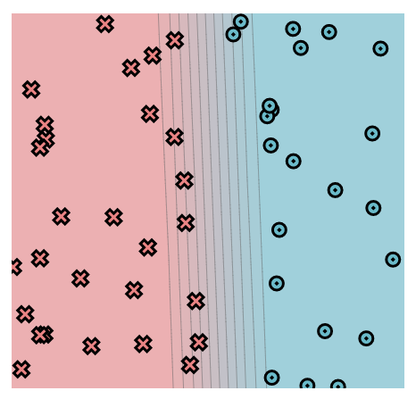

# MiniTorch Module 0
## Project documentation:
* Docs: https://minitorch.github.io/
* Overview: https://minitorch.github.io/module0.html

## Module 0.5:
### linear.weight_0_0  = -10.0
- This parameter defines how steep the transition from one class to the other is, the lower it is, the faster is the switch, so it made sense to maximise it for this task.
### linear.weight_1_0 = -0.37
- This parameter is the slope of the lines, I chose a sligthly negative coefficient as I observed that the data points have slightly lower 'x' values as 'y' increases.
### linear.bias_0 = 4.97
- This parameter defines the 'x' value from which the first line starts, so I chose this value based on the graphical intuition that the red data points dominate the space for low values of 'x'. 

