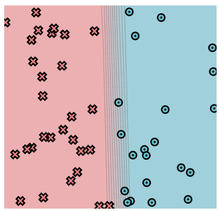
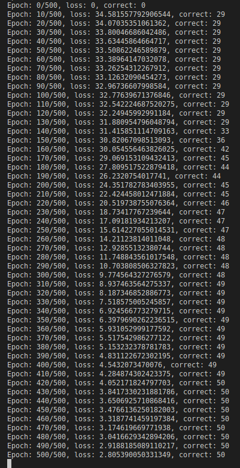

[](https://classroom.github.com/online_ide?assignment_repo_id=8496957&assignment_repo_type=AssignmentRepo)
# MiniTorch Module 1


* Docs: https://minitorch.github.io/

* Overview: https://minitorch.github.io/module1/module1/

This assignment requires the following files from the previous assignments. You can get these by running

```bash
python sync_previous_module.py previous-module-dir current-module-dir
```

The files that will be synced are:

        minitorch/operators.py minitorch/module.py tests/test_module.py tests/test_operators.py project/run_manual.py


## Module 1.5:
### Dataset: Simple  
- __data points__: 50
- __hidden layers__: 2
- __learning rate__: 0.1
- __epochs__: 500


