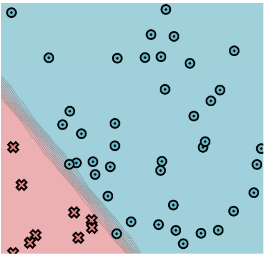

[](https://classroom.github.com/online_ide?assignment_repo_id=8730180&assignment_repo_type=AssignmentRepo)
# MiniTorch Module 2


* Docs: https://minitorch.github.io/

* Overview: https://minitorch.github.io/module2/module2/

This assignment requires the following files from the previous assignments. You can get these by running

```bash
python sync_previous_module.py previous-module-dir current-module-dir
```

The files that will be synced are:

        minitorch/operators.py minitorch/module.py minitorch/autodiff.py minitorch/scalar.py minitorch/module.py project/run_manual.py project/run_scalar.py


## Module 2.5:
### Dataset: Simple  
- __data points__: 50
- __hidden layers__: 2
- __learning rate__: 0.1
- __epochs__: 500

The classification of the simple dataset is linear, hence a simple architecture with just two layers is enough. I kept the learning rate small to allow for a smooth convergence with no loss oscillation.

<p float="left">
        
        
</p>


### Dataset: Diag  
- __data points__: 50
- __hidden layers__: 4
- __learning rate__: 0.5
- __epochs__: 250

The diag classification task is still linear but a bit less trivial than the one above. Therefore I increased the number of hidden layers to 4. A learning rate of 0.5 still allows for a smooth convergence with no big oscillation in loss and decrease the epochs number.

<p float="left">
        
        
</p>


### Dataset: Split  
- __data points__: 50
- __hidden layers__: 6
- __learning rate__: 0.5
- __epochs__: 400

The split dataset is a bit more difficult to learn. I decided for a slightly deeper architecture with 6 layers and keeping a small learning rate of 0.5 to have smooth convergence with no loss oscillation, but that required a bit more epochs to train compared to diag.

<p float="left">
        
        
</p>


### Dataset: Xor  
- __data points__: 50
- __hidden layers__: 9
- __learning rate__: 0.5
- __epochs__: 550

This is the most difficult dataset to learn. I choose 9 layers but kept the learning rate to 0.5 since it was big enough to eventually converge while keeping the oscillation small.

<p float="left">
        
        
</p>

