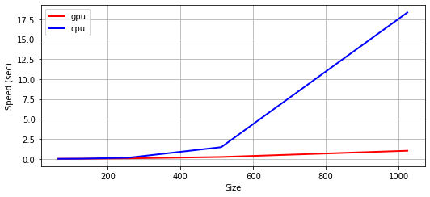

# MiniTorch Module 3


* Docs: https://minitorch.github.io/

* Overview: https://minitorch.github.io/module3.html


You will need to modify `tensor_functions.py` slightly in this assignment.

* Tests:

```
python run_tests.py
```

* Note:

Several of the tests for this assignment will only run if you are on a GPU machine and will not
run on github's test infrastructure. Please follow the instructions to setup up a colab machine
to run these tests.

This assignment requires the following files from the previous assignments. You can get these by running

```bash
python sync_previous_module.py previous-module-dir current-module-dir
```

The files that will be synced are:

        minitorch/tensor_data.py minitorch/tensor_functions.py minitorch/tensor_ops.py minitorch/operators.py minitorch/module.py minitorch/autodiff.py minitorch/module.py project/run_manual.py project/run_scalar.py project/run_tensor.py

## Task 3.1

### Include the diagnostics output from the above script in your README.
```
MAP
 
================================================================================
 Parallel Accelerator Optimizing:  Function tensor_map.<locals>._map, 
/home/fabio/Documents/Cornell/MLE/mle-module-3-Fabio752/minitorch/fast_ops.py 
(154)  
================================================================================


Parallel loop listing for  Function tensor_map.<locals>._map, /home/fabio/Documents/Cornell/MLE/mle-module-3-Fabio752/minitorch/fast_ops.py (154) 
---------------------------------------------------------------------------------------|loop #ID
    def _map(                                                                          | 
        out: Storage,                                                                  | 
        out_shape: Shape,                                                              | 
        out_strides: Strides,                                                          | 
        in_storage: Storage,                                                           | 
        in_shape: Shape,                                                               | 
        in_strides: Strides,                                                           | 
    ) -> None:                                                                         | 
        if len(in_storage) == len(out) and np.array_equal(out_strides, in_strides):    | 
            for i in prange(len(out)):-------------------------------------------------| #0
                out[i] = fn(in_storage[i])                                             | 
        else:                                                                          | 
            for idx in prange(len(out)):-----------------------------------------------| #1
                out_index = np.empty(MAX_DIMS, np.int32)                               | 
                in_index = np.empty(MAX_DIMS, np.int32)                                | 
                to_index(idx, out_shape, out_index)                                    | 
                broadcast_index(out_index, out_shape, in_shape, in_index)              | 
                                                                                       | 
                pos_in = index_to_position(in_index, in_strides)                       | 
                pos_out = index_to_position(out_index, out_strides)                    | 
                                                                                       | 
                out[pos_out] = fn(in_storage[pos_in])                                  | 
--------------------------------- Fusing loops ---------------------------------
Attempting fusion of parallel loops (combines loops with similar properties)...
Following the attempted fusion of parallel for-loops there are 2 parallel for-
loop(s) (originating from loops labelled: #0, #1).
--------------------------------------------------------------------------------
----------------------------- Before Optimisation ------------------------------
--------------------------------------------------------------------------------
------------------------------ After Optimisation ------------------------------
Parallel structure is already optimal.
--------------------------------------------------------------------------------
--------------------------------------------------------------------------------
 
---------------------------Loop invariant code motion---------------------------
Allocation hoisting:
The memory allocation derived from the instruction at 
/home/fabio/Documents/Cornell/MLE/mle-module-3-Fabio752/minitorch/fast_ops.py 
(167) is hoisted out of the parallel loop labelled #1 (it will be performed 
before the loop is executed and reused inside the loop):
   Allocation:: out_index = np.empty(MAX_DIMS, np.int32)
    - numpy.empty() is used for the allocation.
The memory allocation derived from the instruction at 
/home/fabio/Documents/Cornell/MLE/mle-module-3-Fabio752/minitorch/fast_ops.py 
(168) is hoisted out of the parallel loop labelled #1 (it will be performed 
before the loop is executed and reused inside the loop):
   Allocation:: in_index = np.empty(MAX_DIMS, np.int32)
    - numpy.empty() is used for the allocation.
None
ZIP
 
================================================================================
 Parallel Accelerator Optimizing:  Function tensor_zip.<locals>._zip, 
/home/fabio/Documents/Cornell/MLE/mle-module-3-Fabio752/minitorch/fast_ops.py 
(202)  
================================================================================


Parallel loop listing for  Function tensor_zip.<locals>._zip, /home/fabio/Documents/Cornell/MLE/mle-module-3-Fabio752/minitorch/fast_ops.py (202) 
-----------------------------------------------------------------------------------|loop #ID
    def _zip(                                                                      | 
        out: Storage,                                                              | 
        out_shape: Shape,                                                          | 
        out_strides: Strides,                                                      | 
        a_storage: Storage,                                                        | 
        a_shape: Shape,                                                            | 
        a_strides: Strides,                                                        | 
        b_storage: Storage,                                                        | 
        b_shape: Shape,                                                            | 
        b_strides: Strides,                                                        | 
    ) -> None:                                                                     | 
        if (                                                                       | 
            len(a_storage) == len(b_storage)                                       | 
            and len(out) == len(a_storage)                                         | 
            and np.array_equal(out_strides, a_strides)                             | 
            and np.array_equal(a_strides, b_strides)                               | 
        ):                                                                         | 
            # considering special condition when out and a,b are stride-aligned    | 
            for i in prange(len(out)):---------------------------------------------| #2
                out[i] = fn(a_storage[i], b_storage[i])                            | 
        else:                                                                      | 
            for idx in prange(len(out)):-------------------------------------------| #3
                out_index = np.empty(MAX_DIMS, np.int32)                           | 
                a_index = np.empty(MAX_DIMS, np.int32)                             | 
                b_index = np.empty(MAX_DIMS, np.int32)                             | 
                to_index(idx, out_shape, out_index)                                | 
                                                                                   | 
                pos_out = index_to_position(out_index, out_strides)                | 
                                                                                   | 
                broadcast_index(out_index, out_shape, a_shape, a_index)            | 
                pos_a = index_to_position(a_index, a_strides)                      | 
                                                                                   | 
                broadcast_index(out_index, out_shape, b_shape, b_index)            | 
                pos_b = index_to_position(b_index, b_strides)                      | 
                                                                                   | 
                out[pos_out] = fn(a_storage[pos_a], b_storage[pos_b])              | 
--------------------------------- Fusing loops ---------------------------------
Attempting fusion of parallel loops (combines loops with similar properties)...
Following the attempted fusion of parallel for-loops there are 2 parallel for-
loop(s) (originating from loops labelled: #2, #3).
--------------------------------------------------------------------------------
----------------------------- Before Optimisation ------------------------------
--------------------------------------------------------------------------------
------------------------------ After Optimisation ------------------------------
Parallel structure is already optimal.
--------------------------------------------------------------------------------
--------------------------------------------------------------------------------
 
---------------------------Loop invariant code motion---------------------------
Allocation hoisting:
The memory allocation derived from the instruction at 
/home/fabio/Documents/Cornell/MLE/mle-module-3-Fabio752/minitorch/fast_ops.py 
(224) is hoisted out of the parallel loop labelled #3 (it will be performed 
before the loop is executed and reused inside the loop):
   Allocation:: out_index = np.empty(MAX_DIMS, np.int32)
    - numpy.empty() is used for the allocation.
The memory allocation derived from the instruction at 
/home/fabio/Documents/Cornell/MLE/mle-module-3-Fabio752/minitorch/fast_ops.py 
(225) is hoisted out of the parallel loop labelled #3 (it will be performed 
before the loop is executed and reused inside the loop):
   Allocation:: a_index = np.empty(MAX_DIMS, np.int32)
    - numpy.empty() is used for the allocation.
The memory allocation derived from the instruction at 
/home/fabio/Documents/Cornell/MLE/mle-module-3-Fabio752/minitorch/fast_ops.py 
(226) is hoisted out of the parallel loop labelled #3 (it will be performed 
before the loop is executed and reused inside the loop):
   Allocation:: b_index = np.empty(MAX_DIMS, np.int32)
    - numpy.empty() is used for the allocation.
None
REDUCE
 
================================================================================
 Parallel Accelerator Optimizing:  Function tensor_reduce.<locals>._reduce, 
/home/fabio/Documents/Cornell/MLE/mle-module-3-Fabio752/minitorch/fast_ops.py 
(261)  
================================================================================


Parallel loop listing for  Function tensor_reduce.<locals>._reduce, /home/fabio/Documents/Cornell/MLE/mle-module-3-Fabio752/minitorch/fast_ops.py (261) 
-----------------------------------------------------------------|loop #ID
    def _reduce(                                                 | 
        out: Storage,                                            | 
        out_shape: Shape,                                        | 
        out_strides: Strides,                                    | 
        a_storage: Storage,                                      | 
        a_shape: Shape,                                          | 
        a_strides: Strides,                                      | 
        reduce_dim: int,                                         | 
    ) -> None:                                                   | 
        for out_i in prange(len(out)):---------------------------| #4
            out_idx = np.empty(len(a_shape), dtype=np.int32)     | 
            to_index(out_i, out_shape, out_idx)                  | 
            pos_out = index_to_position(out_idx, out_strides)    | 
            pos_a = index_to_position(out_idx, a_strides)        | 
                                                                 | 
            acc = out[pos_out]                                   | 
            for _ in range(a_shape[reduce_dim]):                 | 
                acc = fn(acc, a_storage[pos_a])                  | 
                pos_a += a_strides[reduce_dim]                   | 
                                                                 | 
            out[pos_out] = acc                                   | 
--------------------------------- Fusing loops ---------------------------------
Attempting fusion of parallel loops (combines loops with similar properties)...
Following the attempted fusion of parallel for-loops there are 1 parallel for-
loop(s) (originating from loops labelled: #4).
--------------------------------------------------------------------------------
----------------------------- Before Optimisation ------------------------------
--------------------------------------------------------------------------------
------------------------------ After Optimisation ------------------------------
Parallel structure is already optimal.
--------------------------------------------------------------------------------
--------------------------------------------------------------------------------
 
---------------------------Loop invariant code motion---------------------------
Allocation hoisting:
The memory allocation derived from the instruction at 
/home/fabio/Documents/Cornell/MLE/mle-module-3-Fabio752/minitorch/fast_ops.py 
(271) is hoisted out of the parallel loop labelled #4 (it will be performed 
before the loop is executed and reused inside the loop):
   Allocation:: out_idx = np.empty(len(a_shape), dtype=np.int32)
    - numpy.empty() is used for the allocation.
None
```

## Task 3.2
### Include the diagnostics output from the above script in your README.

```
MATRIX MULTIPLY
 
================================================================================
 Parallel Accelerator Optimizing:  Function _tensor_matrix_multiply, 
/home/fabio/Documents/Cornell/MLE/mle-module-3-Fabio752/minitorch/fast_ops.py 
(286)  
================================================================================


Parallel loop listing for  Function _tensor_matrix_multiply, /home/fabio/Documents/Cornell/MLE/mle-module-3-Fabio752/minitorch/fast_ops.py (286) 
-------------------------------------------------------------------------------|loop #ID
def _tensor_matrix_multiply(                                                   | 
    out: Storage,                                                              | 
    out_shape: Shape,                                                          | 
    out_strides: Strides,                                                      | 
    a_storage: Storage,                                                        | 
    a_shape: Shape,                                                            | 
    a_strides: Strides,                                                        | 
    b_storage: Storage,                                                        | 
    b_shape: Shape,                                                            | 
    b_strides: Strides,                                                        | 
) -> None:                                                                     | 
    """                                                                        | 
    NUMBA tensor matrix multiply function.                                     | 
                                                                               | 
    Should work for any tensor shapes that broadcast as long as                | 
                                                                               | 
    ```                                                                        | 
    assert a_shape[-1] == b_shape[-2]                                          | 
    ```                                                                        | 
                                                                               | 
    Optimizations:                                                             | 
                                                                               | 
    * Outer loop in parallel                                                   | 
    * No index buffers or function calls                                       | 
    * Inner loop should have no global writes, 1 multiply.                     | 
                                                                               | 
                                                                               | 
    Args:                                                                      | 
        out (Storage): storage for `out` tensor                                | 
        out_shape (Shape): shape for `out` tensor                              | 
        out_strides (Strides): strides for `out` tensor                        | 
        a_storage (Storage): storage for `a` tensor                            | 
        a_shape (Shape): shape for `a` tensor                                  | 
        a_strides (Strides): strides for `a` tensor                            | 
        b_storage (Storage): storage for `b` tensor                            | 
        b_shape (Shape): shape for `b` tensor                                  | 
        b_strides (Strides): strides for `b` tensor                            | 
                                                                               | 
    Returns:                                                                   | 
        None : Fills in `out`                                                  | 
    """                                                                        | 
    a_batch_stride = a_strides[0] if a_shape[0] > 1 else 0                     | 
    b_batch_stride = b_strides[0] if b_shape[0] > 1 else 0                     | 
                                                                               | 
    assert a_shape[-1] == b_shape[-2]                                          | 
                                                                               | 
    for pos in prange(len(out)):-----------------------------------------------| #5
        out_idx0 = pos // (out_shape[-1] * out_shape[-2])                      | 
        out_idx1 = (pos % (out_shape[-1] * out_shape[-2])) // out_shape[-1]    | 
        out_idx2 = pos % out_shape[-1]                                         | 
                                                                               | 
        out_pos0 = out_idx0 * out_strides[0]                                   | 
        out_pos1 = out_idx1 * out_strides[1]                                   | 
        out_pos2 = out_idx2 * out_strides[2]                                   | 
        out_position = out_pos0 + out_pos1 + out_pos2                          | 
                                                                               | 
        a_start = out_idx0 * a_batch_stride + out_idx1 * a_strides[1]          | 
        b_start = out_idx0 * b_batch_stride + out_idx2 * b_strides[2]          | 
                                                                               | 
        acc = 0                                                                | 
        for i in range(a_shape[-1]):                                           | 
            acc += (                                                           | 
                a_storage[a_start + i * a_strides[2]]                          | 
                * b_storage[b_start + i * b_strides[1]]                        | 
            )                                                                  | 
        out[out_position] = acc                                                | 
--------------------------------- Fusing loops ---------------------------------
Attempting fusion of parallel loops (combines loops with similar properties)...
Following the attempted fusion of parallel for-loops there are 1 parallel for-
loop(s) (originating from loops labelled: #5).
--------------------------------------------------------------------------------
----------------------------- Before Optimisation ------------------------------
--------------------------------------------------------------------------------
------------------------------ After Optimisation ------------------------------
Parallel structure is already optimal.
--------------------------------------------------------------------------------
--------------------------------------------------------------------------------
 
---------------------------Loop invariant code motion---------------------------
Allocation hoisting:
No allocation hoisting found
None
```
## Task 3.4
- You should document your code to show us that you understand each line. 
- Prove to us that these lead to speed-ups on large matrix operations by making a graph comparing them to naive operations.



## Task 3.5

### Train a tensor model and add your results for all dataset to the README.
#### Simple
- GPU OUTPUT
```
!cd $DIR; PYTHONPATH=/content/$DIR python3.8 project/run_fast_tensor.py --BACKEND gpu --HIDDEN 100 --DATASET simple --RATE 0.05 > simple_gpu.txt

Epoch  0  time  10.738990306854248
Epoch  0  loss  6.166399815416848 correct 39
Epoch  1  time  3.6301870346069336
Epoch  2  time  3.8022689819335938
Epoch  3  time  3.722200632095337
Epoch  4  time  3.552046060562134
Epoch  5  time  3.9399619102478027
Epoch  6  time  3.6926229000091553
Epoch  7  time  3.485779285430908
Epoch  8  time  3.8396170139312744
Epoch  9  time  3.8038480281829834
Epoch  10  time  3.602932929992676
Epoch  10  loss  1.790070555123619 correct 48
Epoch  11  time  3.771223783493042
Epoch  12  time  4.243238210678101
Epoch  13  time  4.055424928665161
Epoch  14  time  3.709853410720825
Epoch  15  time  3.6507937908172607
Epoch  16  time  3.446636915206909
Epoch  17  time  3.8399131298065186
Epoch  18  time  3.7490546703338623
Epoch  19  time  3.79180908203125
Epoch  20  time  3.932589292526245
Epoch  20  loss  0.8590993618091055 correct 49
Epoch  21  time  4.101179361343384
Epoch  22  time  3.661403179168701
Epoch  23  time  3.8315205574035645
Epoch  24  time  3.945366382598877
Epoch  25  time  4.045325040817261
Epoch  26  time  3.5925893783569336
Epoch  27  time  3.876075506210327
Epoch  28  time  3.9066250324249268
Epoch  29  time  3.8837718963623047
Epoch  30  time  3.760307788848877
Epoch  30  loss  0.4887451683825438 correct 49
Epoch  31  time  3.582559585571289
Epoch  32  time  4.031665086746216
Epoch  33  time  3.5762157440185547
Epoch  34  time  3.380563497543335
Epoch  35  time  3.595133066177368
Epoch  36  time  3.8599536418914795
Epoch  37  time  2.4886977672576904
Epoch  38  time  2.117173433303833
Epoch  39  time  2.088495969772339
Epoch  40  time  2.1617846488952637
Epoch  40  loss  1.390788790456038 correct 49
Epoch  41  time  2.0849812030792236
Epoch  42  time  2.0644822120666504
Epoch  43  time  2.1947569847106934
Epoch  44  time  2.1137759685516357
Epoch  45  time  2.062159538269043
Epoch  46  time  2.104349136352539
Epoch  47  time  2.1502208709716797
Epoch  48  time  2.06356143951416
Epoch  49  time  2.08284068107605
Epoch  50  time  2.164926290512085
Epoch  50  loss  1.574354590447871 correct 50
Epoch  51  time  2.1857268810272217
Epoch  52  time  2.12804913520813
Epoch  53  time  2.1102724075317383
Epoch  54  time  2.089303970336914
Epoch  55  time  2.181713581085205
Epoch  56  time  2.10414719581604
Epoch  57  time  2.0962116718292236
Epoch  58  time  2.1201963424682617
Epoch  59  time  2.227905750274658
Epoch  60  time  2.1635892391204834
Epoch  60  loss  0.7143061726134365 correct 49
Epoch  61  time  2.11806321144104
Epoch  62  time  2.163408041000366
Epoch  63  time  2.047703742980957
Epoch  64  time  2.062392473220825
Epoch  65  time  2.315441370010376
Epoch  66  time  3.405735492706299
Epoch  67  time  3.645632266998291
Epoch  68  time  3.661355495452881
Epoch  69  time  2.672893762588501
Epoch  70  time  2.226168155670166
Epoch  70  loss  0.9219711732432372 correct 49
Epoch  71  time  2.1493964195251465
Epoch  72  time  2.1369123458862305
Epoch  73  time  2.136162519454956
Epoch  74  time  2.1969521045684814
Epoch  75  time  2.1376116275787354
Epoch  76  time  2.119156837463379
Epoch  77  time  2.0202670097351074
Epoch  78  time  2.108163356781006
Epoch  79  time  2.057436227798462
Epoch  80  time  2.0391180515289307
Epoch  80  loss  1.2202307991744978 correct 49
Epoch  81  time  2.0529775619506836
Epoch  82  time  2.2087178230285645
Epoch  83  time  2.0988430976867676
Epoch  84  time  2.0900771617889404
Epoch  85  time  2.2190675735473633
Epoch  86  time  2.136204481124878
Epoch  87  time  2.1590144634246826
Epoch  88  time  2.1439359188079834
Epoch  89  time  2.235414743423462
Epoch  90  time  2.127014636993408
Epoch  90  loss  0.024776444927207875 correct 49
Epoch  91  time  2.1440069675445557
Epoch  92  time  2.059809446334839
Epoch  93  time  2.1963436603546143
Epoch  94  time  2.0516579151153564
Epoch  95  time  2.02272629737854
Epoch  96  time  2.0589537620544434
Epoch  97  time  2.1272900104522705
Epoch  98  time  2.0943102836608887
Epoch  99  time  2.1339147090911865
Epoch  100  time  2.1522603034973145
Epoch  100  loss  0.08423550173246355 correct 50
Epoch  101  time  2.2502613067626953
Epoch  102  time  2.102431297302246
Epoch  103  time  2.1177945137023926
Epoch  104  time  2.1722283363342285
Epoch  105  time  2.0949819087982178
Epoch  106  time  2.1800904273986816
Epoch  107  time  2.1172330379486084
Epoch  108  time  2.1934597492218018
Epoch  109  time  2.0960190296173096
Epoch  110  time  2.1303558349609375
Epoch  110  loss  0.44818332179247045 correct 49
Epoch  111  time  2.071835517883301
Epoch  112  time  2.1385610103607178
Epoch  113  time  2.008772373199463
Epoch  114  time  2.0395092964172363
Epoch  115  time  2.0454206466674805
Epoch  116  time  2.179375648498535
Epoch  117  time  2.08846116065979
Epoch  118  time  2.0935137271881104
Epoch  119  time  2.108597755432129
Epoch  120  time  2.204965829849243
Epoch  120  loss  1.3210481435933326 correct 49
Epoch  121  time  2.1157147884368896
Epoch  122  time  2.101851224899292
Epoch  123  time  2.0843896865844727
Epoch  124  time  2.1983277797698975
Epoch  125  time  2.1824889183044434
Epoch  126  time  2.1002209186553955
Epoch  127  time  2.1778030395507812
Epoch  128  time  2.1042888164520264
Epoch  129  time  2.014126777648926
Epoch  130  time  2.071146249771118
Epoch  130  loss  0.16089861717531106 correct 49
Epoch  131  time  2.17511248588562
Epoch  132  time  2.0839216709136963
Epoch  133  time  2.104790210723877
Epoch  134  time  2.1271557807922363
Epoch  135  time  2.21414852142334
Epoch  136  time  2.095233917236328
Epoch  137  time  2.1115221977233887
Epoch  138  time  2.071775197982788
Epoch  139  time  2.22580885887146
Epoch  140  time  2.1151387691497803
Epoch  140  loss  1.5831987514505037 correct 50
Epoch  141  time  2.1196823120117188
Epoch  142  time  2.1500983238220215
Epoch  143  time  2.225512742996216
Epoch  144  time  2.161165237426758
Epoch  145  time  2.0972740650177
Epoch  146  time  2.137089490890503
Epoch  147  time  2.0541791915893555
Epoch  148  time  2.027215003967285
Epoch  149  time  2.0820565223693848
Epoch  150  time  2.175966501235962
Epoch  150  loss  0.4968239317441333 correct 49
Epoch  151  time  2.100337266921997
Epoch  152  time  2.1171019077301025
Epoch  153  time  2.0723068714141846
Epoch  154  time  2.225069761276245
Epoch  155  time  2.094423532485962
Epoch  156  time  2.130687713623047
Epoch  157  time  2.104062795639038
Epoch  158  time  2.2121939659118652
Epoch  159  time  2.1175425052642822
Epoch  160  time  2.094203472137451
Epoch  160  loss  0.04220576051182781 correct 49
Epoch  161  time  2.107891321182251
Epoch  162  time  2.197432041168213
Epoch  163  time  2.0953736305236816
Epoch  164  time  2.050922155380249
Epoch  165  time  2.1860129833221436
Epoch  166  time  2.030892848968506
Epoch  167  time  2.079036235809326
Epoch  168  time  2.115774631500244
Epoch  169  time  2.1843931674957275
Epoch  170  time  2.1152267456054688
Epoch  170  loss  0.3139152739021091 correct 49
Epoch  171  time  2.1100449562072754
Epoch  172  time  2.111457109451294
Epoch  173  time  2.198439836502075
Epoch  174  time  2.1073594093322754
Epoch  175  time  2.079760789871216
Epoch  176  time  2.087968587875366
Epoch  177  time  2.17825984954834
Epoch  178  time  2.098653793334961
Epoch  179  time  2.096489429473877
Epoch  180  time  2.0778419971466064
Epoch  180  loss  0.31261591278497136 correct 49
Epoch  181  time  2.159698247909546
Epoch  182  time  2.0351979732513428
Epoch  183  time  2.3640449047088623
Epoch  184  time  3.505418300628662
Epoch  185  time  3.624776840209961
Epoch  186  time  3.631516933441162
Epoch  187  time  2.4865546226501465
Epoch  188  time  2.1884915828704834
Epoch  189  time  2.1298108100891113
Epoch  190  time  2.127929925918579
Epoch  190  loss  0.2993832398104057 correct 49
Epoch  191  time  2.1194615364074707
Epoch  192  time  2.1970601081848145
Epoch  193  time  2.128009796142578
Epoch  194  time  2.1448402404785156
Epoch  195  time  2.0775210857391357
Epoch  196  time  2.1954429149627686
Epoch  197  time  2.0888710021972656
Epoch  198  time  2.086306571960449
Epoch  199  time  2.080272912979126
Epoch  200  time  2.2079594135284424
Epoch  200  loss  1.4360989956832653 correct 49
Epoch  201  time  2.161311388015747
Epoch  202  time  2.1502320766448975
Epoch  203  time  2.123870611190796
Epoch  204  time  2.217318534851074
Epoch  205  time  2.0788447856903076
Epoch  206  time  2.076627492904663
Epoch  207  time  2.203378677368164
Epoch  208  time  2.137402296066284
Epoch  209  time  2.1224913597106934
Epoch  210  time  2.133267879486084
Epoch  210  loss  1.6130368329604776 correct 49
Epoch  211  time  2.2233963012695312
Epoch  212  time  2.100558280944824
Epoch  213  time  2.0580830574035645
Epoch  214  time  2.0366084575653076
Epoch  215  time  2.1038265228271484
Epoch  216  time  2.0272481441497803
Epoch  217  time  2.021937847137451
Epoch  218  time  2.1240878105163574
Epoch  219  time  2.1968305110931396
Epoch  220  time  2.097249984741211
Epoch  220  loss  0.7989323877835864 correct 49
Epoch  221  time  2.120140552520752
Epoch  222  time  2.1006879806518555
Epoch  223  time  2.220390558242798
Epoch  224  time  2.148263692855835
Epoch  225  time  2.115720510482788
Epoch  226  time  2.112696409225464
Epoch  227  time  2.2238595485687256
Epoch  228  time  2.1382811069488525
Epoch  229  time  2.1065022945404053
Epoch  230  time  2.144723892211914
Epoch  230  loss  1.0462837680225323 correct 50
Epoch  231  time  2.0378434658050537
Epoch  232  time  2.060044527053833
Epoch  233  time  2.062370538711548
Epoch  234  time  2.169344425201416
Epoch  235  time  2.1325790882110596
Epoch  236  time  2.118809700012207
Epoch  237  time  2.171684503555298
Epoch  238  time  2.2282638549804688
Epoch  239  time  2.1234700679779053
Epoch  240  time  2.1103219985961914
Epoch  240  loss  0.3803834937943896 correct 49
Epoch  241  time  2.1161067485809326
Epoch  242  time  2.2207605838775635
Epoch  243  time  2.1122934818267822
Epoch  244  time  2.1085093021392822
Epoch  245  time  2.1274077892303467
Epoch  246  time  2.231154441833496
Epoch  247  time  2.107464551925659
Epoch  248  time  2.0513367652893066
Epoch  249  time  2.0772018432617188
Epoch  250  time  2.1413795948028564
Epoch  250  loss  2.1922728330950365 correct 50
Epoch  251  time  2.060068368911743
Epoch  252  time  2.1160829067230225
Epoch  253  time  2.217744827270508
Epoch  254  time  2.1014437675476074
Epoch  255  time  2.1467928886413574
Epoch  256  time  2.175762414932251
Epoch  257  time  2.2504632472991943
Epoch  258  time  2.1250298023223877
Epoch  259  time  2.1068990230560303
Epoch  260  time  2.1094212532043457
Epoch  260  loss  0.9002894433438939 correct 49
Epoch  261  time  2.221278667449951
Epoch  262  time  2.107574462890625
Epoch  263  time  2.119018316268921
Epoch  264  time  2.0826354026794434
Epoch  265  time  2.188977003097534
Epoch  266  time  2.0957634449005127
Epoch  267  time  2.066227674484253
Epoch  268  time  2.0628132820129395
Epoch  269  time  2.2024314403533936
Epoch  270  time  2.0840792655944824
Epoch  270  loss  0.6793605556743779 correct 49
Epoch  271  time  2.1349966526031494
Epoch  272  time  2.2189676761627197
Epoch  273  time  2.111546039581299
Epoch  274  time  2.112102746963501
Epoch  275  time  2.142629623413086
Epoch  276  time  2.174870491027832
Epoch  277  time  2.1018049716949463
Epoch  278  time  2.1384031772613525
Epoch  279  time  2.103572130203247
Epoch  280  time  2.2250311374664307
Epoch  280  loss  1.3470408641637936 correct 50
Epoch  281  time  2.0634374618530273
Epoch  282  time  2.0174801349639893
Epoch  283  time  1.9978384971618652
Epoch  284  time  2.1530137062072754
Epoch  285  time  2.0300707817077637
Epoch  286  time  2.0682992935180664
Epoch  287  time  2.1020376682281494
Epoch  288  time  2.211195707321167
Epoch  289  time  2.1062347888946533
Epoch  290  time  2.1253201961517334
Epoch  290  loss  2.887455458748065 correct 49
Epoch  291  time  2.196732521057129
Epoch  292  time  2.109870672225952
Epoch  293  time  2.144909620285034
Epoch  294  time  2.123724937438965
Epoch  295  time  2.2744643688201904
Epoch  296  time  2.135613441467285
Epoch  297  time  2.1359267234802246
Epoch  298  time  2.131152391433716
Epoch  299  time  2.188779354095459
Epoch  300  time  2.645413875579834
Epoch  300  loss  0.028438623783264463 correct 50
Epoch  301  time  3.48938250541687
Epoch  302  time  3.6747918128967285
Epoch  303  time  3.793820381164551
Epoch  304  time  2.151143789291382
Epoch  305  time  2.1179490089416504
Epoch  306  time  2.145679473876953
Epoch  307  time  2.2509500980377197
Epoch  308  time  2.140409231185913
Epoch  309  time  2.137965679168701
Epoch  310  time  2.230257034301758
Epoch  310  loss  0.5589169745273631 correct 49
Epoch  311  time  2.145326852798462
Epoch  312  time  2.120244026184082
Epoch  313  time  2.0942487716674805
Epoch  314  time  2.2092137336730957
Epoch  315  time  2.02128529548645
Epoch  316  time  2.0688705444335938
Epoch  317  time  2.0686275959014893
Epoch  318  time  2.220062494277954
Epoch  319  time  2.1335480213165283
Epoch  320  time  2.1241281032562256
Epoch  320  loss  0.38665900566251205 correct 49
Epoch  321  time  2.1508312225341797
Epoch  322  time  2.1922919750213623
Epoch  323  time  2.0882468223571777
Epoch  324  time  2.0976955890655518
Epoch  325  time  2.134840250015259
Epoch  326  time  2.2193808555603027
Epoch  327  time  2.129108190536499
Epoch  328  time  2.126549482345581
Epoch  329  time  2.2131035327911377
Epoch  330  time  2.1138455867767334
Epoch  330  loss  0.005383482725580116 correct 49
Epoch  331  time  2.0815329551696777
Epoch  332  time  2.048410177230835
Epoch  333  time  2.1359870433807373
Epoch  334  time  2.086699962615967
Epoch  335  time  2.1364994049072266
Epoch  336  time  2.113416910171509
Epoch  337  time  2.2103021144866943
Epoch  338  time  2.1217033863067627
Epoch  339  time  2.1254513263702393
Epoch  340  time  2.151956558227539
Epoch  340  loss  0.19758181709812372 correct 50
Epoch  341  time  2.207555055618286
Epoch  342  time  2.119070529937744
Epoch  343  time  2.118220567703247
Epoch  344  time  2.142256736755371
Epoch  345  time  2.1893258094787598
Epoch  346  time  2.101393699645996
Epoch  347  time  2.1053738594055176
Epoch  348  time  2.046496629714966
Epoch  349  time  2.1699414253234863
Epoch  350  time  2.0659451484680176
Epoch  350  loss  1.1446882133321414 correct 50
Epoch  351  time  2.058799982070923
Epoch  352  time  2.16615629196167
Epoch  353  time  2.0933773517608643
Epoch  354  time  2.134413719177246
Epoch  355  time  2.0707876682281494
Epoch  356  time  2.206310510635376
Epoch  357  time  2.1087872982025146
Epoch  358  time  2.098493814468384
Epoch  359  time  2.1335020065307617
Epoch  360  time  2.201629877090454
Epoch  360  loss  0.212921319989933 correct 49
Epoch  361  time  2.1070642471313477
Epoch  362  time  2.0968446731567383
Epoch  363  time  2.110624074935913
Epoch  364  time  2.1545348167419434
Epoch  365  time  2.05385160446167
Epoch  366  time  2.0475950241088867
Epoch  367  time  2.064882516860962
Epoch  368  time  2.182299852371216
Epoch  369  time  2.0498063564300537
Epoch  370  time  2.0573792457580566
Epoch  370  loss  0.23651274704665448 correct 49
Epoch  371  time  2.100449323654175
Epoch  372  time  2.2053346633911133
Epoch  373  time  2.1301958560943604
Epoch  374  time  2.1099417209625244
Epoch  375  time  2.2571301460266113
Epoch  376  time  2.126601457595825
Epoch  377  time  2.1274256706237793
Epoch  378  time  2.1409521102905273
Epoch  379  time  2.1756157875061035
Epoch  380  time  2.117236614227295
Epoch  380  loss  0.8554172999034311 correct 49
Epoch  381  time  2.108428716659546
Epoch  382  time  2.096020460128784
Epoch  383  time  2.1777894496917725
Epoch  384  time  2.0286056995391846
Epoch  385  time  2.0609748363494873
Epoch  386  time  2.082378625869751
Epoch  387  time  2.1955368518829346
Epoch  388  time  2.1860134601593018
Epoch  389  time  2.1128017902374268
Epoch  390  time  2.2457237243652344
Epoch  390  loss  0.0987399568716078 correct 49
Epoch  391  time  2.1512279510498047
Epoch  392  time  2.1373608112335205
Epoch  393  time  2.1179957389831543
Epoch  394  time  2.213618755340576
Epoch  395  time  2.1118099689483643
Epoch  396  time  2.1259443759918213
Epoch  397  time  2.1327803134918213
Epoch  398  time  2.2316203117370605
Epoch  399  time  2.1095094680786133
Epoch  400  time  2.045180320739746
Epoch  400  loss  0.008775434888613296 correct 49
Epoch  401  time  2.06807804107666
Epoch  402  time  2.164882183074951
Epoch  403  time  2.0621516704559326
Epoch  404  time  1.974761724472046
Epoch  405  time  2.109901189804077
Epoch  406  time  2.197838068008423
Epoch  407  time  2.1291675567626953
Epoch  408  time  2.0717153549194336
Epoch  409  time  2.167724132537842
Epoch  410  time  2.0794572830200195
Epoch  410  loss  1.3827148183002367 correct 49
Epoch  411  time  2.1112754344940186
Epoch  412  time  2.0983808040618896
Epoch  413  time  2.2194135189056396
Epoch  414  time  2.1196539402008057
Epoch  415  time  2.105815887451172
Epoch  416  time  2.368429183959961
Epoch  417  time  3.288439989089966
Epoch  418  time  3.5706918239593506
Epoch  419  time  3.6090898513793945
Epoch  420  time  2.7143564224243164
Epoch  420  loss  1.4297375418210312 correct 49
Epoch  421  time  2.203643798828125
Epoch  422  time  2.130343198776245
Epoch  423  time  2.0869839191436768
Epoch  424  time  2.12601900100708
Epoch  425  time  2.2232110500335693
Epoch  426  time  2.078085422515869
Epoch  427  time  2.087818145751953
Epoch  428  time  2.108133554458618
Epoch  429  time  2.2166528701782227
Epoch  430  time  2.099600315093994
Epoch  430  loss  1.3994563032166267 correct 50
Epoch  431  time  2.1269752979278564
Epoch  432  time  2.125869035720825
Epoch  433  time  2.050175189971924
Epoch  434  time  2.0194919109344482
Epoch  435  time  2.0505781173706055
Epoch  436  time  2.1434197425842285
Epoch  437  time  2.082042694091797
Epoch  438  time  2.1020987033843994
Epoch  439  time  2.08827805519104
Epoch  440  time  2.201606512069702
Epoch  440  loss  0.3619393110993707 correct 50
Epoch  441  time  2.1034185886383057
Epoch  442  time  2.095804452896118
Epoch  443  time  2.126779794692993
Epoch  444  time  2.15194034576416
Epoch  445  time  2.0550343990325928
Epoch  446  time  2.0999910831451416
Epoch  447  time  2.090566873550415
Epoch  448  time  2.2077367305755615
Epoch  449  time  2.041811466217041
Epoch  450  time  2.0701470375061035
Epoch  450  loss  0.013596363539656486 correct 49
Epoch  451  time  2.1009421348571777
Epoch  452  time  2.0301220417022705
Epoch  453  time  2.00799560546875
Epoch  454  time  2.0930542945861816
Epoch  455  time  2.170323610305786
Epoch  456  time  2.094832181930542
Epoch  457  time  2.1518967151641846
Epoch  458  time  2.1075286865234375
Epoch  459  time  2.1787195205688477
Epoch  460  time  2.1514556407928467
Epoch  460  loss  0.016742273794115307 correct 49
Epoch  461  time  2.099219799041748
Epoch  462  time  2.121124744415283
Epoch  463  time  2.17961049079895
Epoch  464  time  2.1054089069366455
Epoch  465  time  2.0983798503875732
Epoch  466  time  2.0704894065856934
Epoch  467  time  2.1549205780029297
Epoch  468  time  2.0452284812927246
Epoch  469  time  2.0525081157684326
Epoch  470  time  2.0404605865478516
Epoch  470  loss  7.678273752044471e-05 correct 49
Epoch  471  time  2.112236976623535
Epoch  472  time  2.1134424209594727
Epoch  473  time  2.103239059448242
Epoch  474  time  2.2300329208374023
Epoch  475  time  2.061014175415039
Epoch  476  time  2.078930377960205
Epoch  477  time  2.117720127105713
Epoch  478  time  2.219492197036743
Epoch  479  time  2.08089542388916
Epoch  480  time  2.0874829292297363
Epoch  480  loss  0.41465414590377836 correct 50
Epoch  481  time  2.105048656463623
Epoch  482  time  2.1630985736846924
Epoch  483  time  2.0916404724121094
Epoch  484  time  2.0230820178985596
Epoch  485  time  2.0672709941864014
Epoch  486  time  2.2069220542907715
Epoch  487  time  2.057708501815796
Epoch  488  time  2.0872416496276855
Epoch  489  time  2.087202548980713
Epoch  490  time  2.2000200748443604
Epoch  490  loss  0.008186120642919778 correct 49
Epoch  491  time  2.1254303455352783
Epoch  492  time  2.096020221710205
Epoch  493  time  2.1722524166107178
Epoch  494  time  2.0690503120422363
Epoch  495  time  2.0947265625
Epoch  496  time  2.143742561340332
Epoch  497  time  2.207562208175659
Epoch  498  time  2.097102642059326
Epoch  499  time  2.0895488262176514
Average time per epoch 2.3006363592147827 (for 500 epochs)
```

- CPU OUTPUT
```
!cd $DIR; PYTHONPATH=/content/$DIR python3.8 project/run_fast_tensor.py --BACKEND cpu --HIDDEN 100 --DATASET simple --RATE 0.05 > simple_cpu.txt

Epoch  0  time  20.80432105064392
Epoch  0  loss  4.951982493732821 correct 45
Epoch  1  time  0.09446001052856445
Epoch  2  time  0.09084725379943848
Epoch  3  time  0.09164261817932129
Epoch  4  time  0.10716438293457031
Epoch  5  time  0.08817839622497559
Epoch  6  time  0.08861875534057617
Epoch  7  time  0.08898067474365234
Epoch  8  time  0.0905609130859375
Epoch  9  time  0.09343838691711426
Epoch  10  time  0.08799386024475098
Epoch  10  loss  1.945637940523269 correct 49
Epoch  11  time  0.08319354057312012
Epoch  12  time  0.086395263671875
Epoch  13  time  0.18883466720581055
Epoch  14  time  0.10581517219543457
Epoch  15  time  0.08765649795532227
Epoch  16  time  0.08736085891723633
Epoch  17  time  0.09266138076782227
Epoch  18  time  0.09027671813964844
Epoch  19  time  0.08687543869018555
Epoch  20  time  0.08767390251159668
Epoch  20  loss  0.5542452832053291 correct 48
Epoch  21  time  0.08815884590148926
Epoch  22  time  0.08843684196472168
Epoch  23  time  0.09070086479187012
Epoch  24  time  0.08816814422607422
Epoch  25  time  0.10570240020751953
Epoch  26  time  0.08950376510620117
Epoch  27  time  0.08727717399597168
Epoch  28  time  0.08852601051330566
Epoch  29  time  0.09058046340942383
Epoch  30  time  0.0875091552734375
Epoch  30  loss  1.2253283965610238 correct 49
Epoch  31  time  0.0917367935180664
Epoch  32  time  0.09000039100646973
Epoch  33  time  0.08902573585510254
Epoch  34  time  0.09106898307800293
Epoch  35  time  0.08992624282836914
Epoch  36  time  0.09149980545043945
Epoch  37  time  0.10761189460754395
Epoch  38  time  0.08888435363769531
Epoch  39  time  0.08632540702819824
Epoch  40  time  0.08864045143127441
Epoch  40  loss  1.0371046941348585 correct 50
Epoch  41  time  0.0866696834564209
Epoch  42  time  0.08482861518859863
Epoch  43  time  0.08844447135925293
Epoch  44  time  0.08912825584411621
Epoch  45  time  0.0930185317993164
Epoch  46  time  0.08878135681152344
Epoch  47  time  0.08971476554870605
Epoch  48  time  0.10457277297973633
Epoch  49  time  0.08780121803283691
Epoch  50  time  0.0939183235168457
Epoch  50  loss  1.2611121216058465 correct 50
Epoch  51  time  0.09131097793579102
Epoch  52  time  0.09083032608032227
Epoch  53  time  0.08950185775756836
Epoch  54  time  0.08913755416870117
Epoch  55  time  0.09181880950927734
Epoch  56  time  0.09188699722290039
Epoch  57  time  0.08889269828796387
Epoch  58  time  0.09201478958129883
Epoch  59  time  0.10535073280334473
Epoch  60  time  0.08793878555297852
Epoch  60  loss  0.40444030229834854 correct 50
Epoch  61  time  0.08587074279785156
Epoch  62  time  0.08576822280883789
Epoch  63  time  0.0918874740600586
Epoch  64  time  0.08653807640075684
Epoch  65  time  0.08555030822753906
Epoch  66  time  0.08618402481079102
Epoch  67  time  0.08668828010559082
Epoch  68  time  0.0841376781463623
Epoch  69  time  0.08518552780151367
Epoch  70  time  0.08070206642150879
Epoch  70  loss  1.1806298801026347 correct 50
Epoch  71  time  0.0958867073059082
Epoch  72  time  0.08174490928649902
Epoch  73  time  0.08472704887390137
Epoch  74  time  0.10546326637268066
Epoch  75  time  0.08644461631774902
Epoch  76  time  0.08711361885070801
Epoch  77  time  0.08910894393920898
Epoch  78  time  0.09715843200683594
Epoch  79  time  0.08425569534301758
Epoch  80  time  0.08914947509765625
Epoch  80  loss  0.5287110727885002 correct 50
Epoch  81  time  0.08548283576965332
Epoch  82  time  0.10315728187561035
Epoch  83  time  0.08600735664367676
Epoch  84  time  0.09375476837158203
Epoch  85  time  0.08799862861633301
Epoch  86  time  0.08849334716796875
Epoch  87  time  0.08791422843933105
Epoch  88  time  0.08833432197570801
Epoch  89  time  0.08982419967651367
Epoch  90  time  0.0848243236541748
Epoch  90  loss  0.37871200558321966 correct 50
Epoch  91  time  0.08808016777038574
Epoch  92  time  0.0843195915222168
Epoch  93  time  0.08518576622009277
Epoch  94  time  0.10250282287597656
Epoch  95  time  0.1154336929321289
Epoch  96  time  0.08632063865661621
Epoch  97  time  0.0904390811920166
Epoch  98  time  0.09586215019226074
Epoch  99  time  0.08705902099609375
Epoch  100  time  0.09218788146972656
Epoch  100  loss  0.2745204927942155 correct 50
Epoch  101  time  0.08858203887939453
Epoch  102  time  0.09035634994506836
Epoch  103  time  0.08768510818481445
Epoch  104  time  0.08950972557067871
Epoch  105  time  0.10223388671875
Epoch  106  time  0.08660316467285156
Epoch  107  time  0.09210705757141113
Epoch  108  time  0.0897519588470459
Epoch  109  time  0.08535337448120117
Epoch  110  time  0.08508872985839844
Epoch  110  loss  0.7264404466076911 correct 50
Epoch  111  time  0.0876474380493164
Epoch  112  time  0.08866429328918457
Epoch  113  time  0.08674192428588867
Epoch  114  time  0.08510732650756836
Epoch  115  time  0.08624053001403809
Epoch  116  time  0.10248589515686035
Epoch  117  time  0.0892634391784668
Epoch  118  time  0.0881800651550293
Epoch  119  time  0.0831441879272461
Epoch  120  time  0.08602118492126465
Epoch  120  loss  0.5061406856674467 correct 50
Epoch  121  time  0.08397293090820312
Epoch  122  time  0.09903621673583984
Epoch  123  time  0.0858602523803711
Epoch  124  time  0.08797645568847656
Epoch  125  time  0.08275961875915527
Epoch  126  time  0.08391976356506348
Epoch  127  time  0.08463025093078613
Epoch  128  time  0.10413312911987305
Epoch  129  time  0.08678579330444336
Epoch  130  time  0.08973193168640137
Epoch  130  loss  0.06007415793971892 correct 50
Epoch  131  time  0.08198690414428711
Epoch  132  time  0.0870361328125
Epoch  133  time  0.09031176567077637
Epoch  134  time  0.0870826244354248
Epoch  135  time  0.08671092987060547
Epoch  136  time  0.08360075950622559
Epoch  137  time  0.08783936500549316
Epoch  138  time  0.08647298812866211
Epoch  139  time  0.1037297248840332
Epoch  140  time  0.09259963035583496
Epoch  140  loss  0.29334399149477597 correct 50
Epoch  141  time  0.08689284324645996
Epoch  142  time  0.08538031578063965
Epoch  143  time  0.08551883697509766
Epoch  144  time  0.08546042442321777
Epoch  145  time  0.08650350570678711
Epoch  146  time  0.08344030380249023
Epoch  147  time  0.08790850639343262
Epoch  148  time  0.08704137802124023
Epoch  149  time  0.08873629570007324
Epoch  150  time  0.08960103988647461
Epoch  150  loss  0.3662203719727696 correct 50
Epoch  151  time  0.10994601249694824
Epoch  152  time  0.0821075439453125
Epoch  153  time  0.08042168617248535
Epoch  154  time  0.08500242233276367
Epoch  155  time  0.08632779121398926
Epoch  156  time  0.09109759330749512
Epoch  157  time  0.08724403381347656
Epoch  158  time  0.08697652816772461
Epoch  159  time  0.08796358108520508
Epoch  160  time  0.08483171463012695
Epoch  160  loss  0.0329032248622964 correct 50
Epoch  161  time  0.08575320243835449
Epoch  162  time  0.10358023643493652
Epoch  163  time  0.08841538429260254
Epoch  164  time  0.09185481071472168
Epoch  165  time  0.08795809745788574
Epoch  166  time  0.08656430244445801
Epoch  167  time  0.08968877792358398
Epoch  168  time  0.08861970901489258
Epoch  169  time  0.08658838272094727
Epoch  170  time  0.08716344833374023
Epoch  170  loss  0.06917984725164388 correct 50
Epoch  171  time  0.08809876441955566
Epoch  172  time  0.08908510208129883
Epoch  173  time  0.08597779273986816
Epoch  174  time  0.11200547218322754
Epoch  175  time  0.0903007984161377
Epoch  176  time  0.09022259712219238
Epoch  177  time  0.09128594398498535
Epoch  178  time  0.09245443344116211
Epoch  179  time  0.0928184986114502
Epoch  180  time  0.09121155738830566
Epoch  180  loss  0.001718438097427898 correct 50
Epoch  181  time  0.09077119827270508
Epoch  182  time  0.0903632640838623
Epoch  183  time  0.08946681022644043
Epoch  184  time  0.09514927864074707
Epoch  185  time  0.11125802993774414
Epoch  186  time  0.0900564193725586
Epoch  187  time  0.08991146087646484
Epoch  188  time  0.09056973457336426
Epoch  189  time  0.09262943267822266
Epoch  190  time  0.0901331901550293
Epoch  190  loss  0.0017691098388303743 correct 50
Epoch  191  time  0.09311366081237793
Epoch  192  time  0.08974671363830566
Epoch  193  time  0.08957099914550781
Epoch  194  time  0.09165477752685547
Epoch  195  time  0.09125709533691406
Epoch  196  time  0.10898423194885254
Epoch  197  time  0.0923922061920166
Epoch  198  time  0.09040379524230957
Epoch  199  time  0.09429454803466797
Epoch  200  time  0.09346604347229004
Epoch  200  loss  0.02412542420694908 correct 50
Epoch  201  time  0.0918266773223877
Epoch  202  time  0.0921773910522461
Epoch  203  time  0.09054040908813477
Epoch  204  time  0.0908212661743164
Epoch  205  time  0.08958649635314941
Epoch  206  time  0.12401580810546875
Epoch  207  time  0.10230517387390137
Epoch  208  time  0.08984160423278809
Epoch  209  time  0.08981990814208984
Epoch  210  time  0.09125208854675293
Epoch  210  loss  0.1756185971050001 correct 50
Epoch  211  time  0.09775900840759277
Epoch  212  time  0.09237217903137207
Epoch  213  time  0.09109950065612793
Epoch  214  time  0.09099626541137695
Epoch  215  time  0.08954381942749023
Epoch  216  time  0.09409070014953613
Epoch  217  time  0.10225439071655273
Epoch  218  time  0.09912729263305664
Epoch  219  time  0.09161853790283203
Epoch  220  time  0.09241008758544922
Epoch  220  loss  0.47466314577681484 correct 50
Epoch  221  time  0.08889245986938477
Epoch  222  time  0.08987903594970703
Epoch  223  time  0.09004497528076172
Epoch  224  time  0.08872318267822266
Epoch  225  time  0.08985757827758789
Epoch  226  time  0.08956742286682129
Epoch  227  time  0.09174585342407227
Epoch  228  time  0.08998823165893555
Epoch  229  time  0.10884332656860352
Epoch  230  time  0.09051847457885742
Epoch  230  loss  0.32422748614229385 correct 50
Epoch  231  time  0.09015965461730957
Epoch  232  time  0.09169292449951172
Epoch  233  time  0.09127497673034668
Epoch  234  time  0.08992409706115723
Epoch  235  time  0.09022641181945801
Epoch  236  time  0.08968615531921387
Epoch  237  time  0.08789229393005371
Epoch  238  time  0.09445667266845703
Epoch  239  time  0.09011554718017578
Epoch  240  time  0.11121821403503418
Epoch  240  loss  0.7402810629259277 correct 50
Epoch  241  time  0.09040999412536621
Epoch  242  time  0.0931084156036377
Epoch  243  time  0.09105372428894043
Epoch  244  time  0.09370946884155273
Epoch  245  time  0.09002518653869629
Epoch  246  time  0.08799004554748535
Epoch  247  time  0.08866500854492188
Epoch  248  time  0.09428882598876953
Epoch  249  time  0.09320068359375
Epoch  250  time  0.09168577194213867
Epoch  250  loss  0.3665188801857488 correct 50
Epoch  251  time  0.10948634147644043
Epoch  252  time  0.09442496299743652
Epoch  253  time  0.09227752685546875
Epoch  254  time  0.09036517143249512
Epoch  255  time  0.0919954776763916
Epoch  256  time  0.08975553512573242
Epoch  257  time  0.08982157707214355
Epoch  258  time  0.0901498794555664
Epoch  259  time  0.09007382392883301
Epoch  260  time  0.08977842330932617
Epoch  260  loss  0.07880197166220802 correct 50
Epoch  261  time  0.0950937271118164
Epoch  262  time  0.10963010787963867
Epoch  263  time  0.09493899345397949
Epoch  264  time  0.09119558334350586
Epoch  265  time  0.09197759628295898
Epoch  266  time  0.08980751037597656
Epoch  267  time  0.09128141403198242
Epoch  268  time  0.09122371673583984
Epoch  269  time  0.09066176414489746
Epoch  270  time  0.09668660163879395
Epoch  270  loss  0.11801628464591685 correct 50
Epoch  271  time  0.09034037590026855
Epoch  272  time  0.08939170837402344
Epoch  273  time  0.11004376411437988
Epoch  274  time  0.09439587593078613
Epoch  275  time  0.09029507637023926
Epoch  276  time  0.0931396484375
Epoch  277  time  0.09151506423950195
Epoch  278  time  0.09080815315246582
Epoch  279  time  0.09020829200744629
Epoch  280  time  0.09457874298095703
Epoch  280  loss  0.5724617480051478 correct 50
Epoch  281  time  0.09894204139709473
Epoch  282  time  0.0923624038696289
Epoch  283  time  0.09993505477905273
Epoch  284  time  0.10276079177856445
Epoch  285  time  0.09087824821472168
Epoch  286  time  0.09036731719970703
Epoch  287  time  0.09125423431396484
Epoch  288  time  0.09145498275756836
Epoch  289  time  0.09078717231750488
Epoch  290  time  0.09248661994934082
Epoch  290  loss  0.175915369830384 correct 50
Epoch  291  time  0.09194827079772949
Epoch  292  time  0.08944272994995117
Epoch  293  time  0.09436893463134766
Epoch  294  time  0.10654783248901367
Epoch  295  time  0.09489583969116211
Epoch  296  time  0.09241724014282227
Epoch  297  time  0.09185242652893066
Epoch  298  time  0.09048247337341309
Epoch  299  time  0.09005975723266602
Epoch  300  time  0.09177565574645996
Epoch  300  loss  0.0019926917976438355 correct 50
Epoch  301  time  0.09013128280639648
Epoch  302  time  0.09623575210571289
Epoch  303  time  0.08999371528625488
Epoch  304  time  0.0886538028717041
Epoch  305  time  0.10727357864379883
Epoch  306  time  0.09447479248046875
Epoch  307  time  0.09154796600341797
Epoch  308  time  0.09332108497619629
Epoch  309  time  0.09238505363464355
Epoch  310  time  0.09091448783874512
Epoch  310  loss  0.0879398922102432 correct 50
Epoch  311  time  0.08884787559509277
Epoch  312  time  0.09491825103759766
Epoch  313  time  0.08827710151672363
Epoch  314  time  0.0885777473449707
Epoch  315  time  0.08932995796203613
Epoch  316  time  0.10058403015136719
Epoch  317  time  0.09538102149963379
Epoch  318  time  0.0888512134552002
Epoch  319  time  0.0908968448638916
Epoch  320  time  0.11868023872375488
Epoch  320  loss  0.32976467189614633 correct 50
Epoch  321  time  0.08866453170776367
Epoch  322  time  0.09049296379089355
Epoch  323  time  0.09143519401550293
Epoch  324  time  0.08852338790893555
Epoch  325  time  0.09243083000183105
Epoch  326  time  0.08794426918029785
Epoch  327  time  0.1108541488647461
Epoch  328  time  0.10053157806396484
Epoch  329  time  0.09100127220153809
Epoch  330  time  0.08899855613708496
Epoch  330  loss  0.2986511729205663 correct 50
Epoch  331  time  0.08643746376037598
Epoch  332  time  0.08832406997680664
Epoch  333  time  0.08859491348266602
Epoch  334  time  0.0912013053894043
Epoch  335  time  0.09119105339050293
Epoch  336  time  0.08861589431762695
Epoch  337  time  0.08943319320678711
Epoch  338  time  0.11011600494384766
Epoch  339  time  0.09967494010925293
Epoch  340  time  0.11121606826782227
Epoch  340  loss  0.43196374608255783 correct 50
Epoch  341  time  0.09051632881164551
Epoch  342  time  0.08960890769958496
Epoch  343  time  0.09093689918518066
Epoch  344  time  0.09507417678833008
Epoch  345  time  0.08827924728393555
Epoch  346  time  0.08821249008178711
Epoch  347  time  0.09016919136047363
Epoch  348  time  0.09757232666015625
Epoch  349  time  0.11199474334716797
Epoch  350  time  0.09136819839477539
Epoch  350  loss  0.11220106065691826 correct 50
Epoch  351  time  0.09119915962219238
Epoch  352  time  0.08894133567810059
Epoch  353  time  0.09040403366088867
Epoch  354  time  0.08948159217834473
Epoch  355  time  0.08980083465576172
Epoch  356  time  0.08991336822509766
Epoch  357  time  0.09560894966125488
Epoch  358  time  0.09049868583679199
Epoch  359  time  0.09089994430541992
Epoch  360  time  0.10686111450195312
Epoch  360  loss  0.13608472269104963 correct 50
Epoch  361  time  0.09203624725341797
Epoch  362  time  0.08911609649658203
Epoch  363  time  0.08948612213134766
Epoch  364  time  0.08864784240722656
Epoch  365  time  0.08917689323425293
Epoch  366  time  0.09573745727539062
Epoch  367  time  0.08808684349060059
Epoch  368  time  0.0882878303527832
Epoch  369  time  0.09047484397888184
Epoch  370  time  0.09321880340576172
Epoch  370  loss  0.4276770447246655 correct 50
Epoch  371  time  0.10721898078918457
Epoch  372  time  0.09156346321105957
Epoch  373  time  0.08908915519714355
Epoch  374  time  0.08859896659851074
Epoch  375  time  0.08928251266479492
Epoch  376  time  0.09329867362976074
Epoch  377  time  0.09259986877441406
Epoch  378  time  0.09091019630432129
Epoch  379  time  0.09054851531982422
Epoch  380  time  0.09515070915222168
Epoch  380  loss  0.020270131581151752 correct 50
Epoch  381  time  0.09044623374938965
Epoch  382  time  0.2104051113128662
Epoch  383  time  0.08984375
Epoch  384  time  0.09105587005615234
Epoch  385  time  0.08972835540771484
Epoch  386  time  0.09150433540344238
Epoch  387  time  0.09062027931213379
Epoch  388  time  0.0941154956817627
Epoch  389  time  0.08952140808105469
Epoch  390  time  0.09271430969238281
Epoch  390  loss  0.11676171207652934 correct 50
Epoch  391  time  0.09059262275695801
Epoch  392  time  0.11227989196777344
Epoch  393  time  0.08987283706665039
Epoch  394  time  0.09090471267700195
Epoch  395  time  0.09145283699035645
Epoch  396  time  0.09037041664123535
Epoch  397  time  0.0936286449432373
Epoch  398  time  0.1047813892364502
Epoch  399  time  0.08940291404724121
Epoch  400  time  0.0901181697845459
Epoch  400  loss  0.050924335305774455 correct 50
Epoch  401  time  0.0941169261932373
Epoch  402  time  0.09269309043884277
Epoch  403  time  0.10895705223083496
Epoch  404  time  0.08931708335876465
Epoch  405  time  0.08962678909301758
Epoch  406  time  0.08896636962890625
Epoch  407  time  0.09565448760986328
Epoch  408  time  0.08935022354125977
Epoch  409  time  0.0907132625579834
Epoch  410  time  0.09020709991455078
Epoch  410  loss  0.1284439202391168 correct 50
Epoch  411  time  0.09233975410461426
Epoch  412  time  0.09022212028503418
Epoch  413  time  0.0898447036743164
Epoch  414  time  0.11068248748779297
Epoch  415  time  0.09049320220947266
Epoch  416  time  0.09279012680053711
Epoch  417  time  0.09203982353210449
Epoch  418  time  0.09238743782043457
Epoch  419  time  0.09045529365539551
Epoch  420  time  0.09639263153076172
Epoch  420  loss  0.3766028568281936 correct 50
Epoch  421  time  0.09062814712524414
Epoch  422  time  0.09190201759338379
Epoch  423  time  0.09021759033203125
Epoch  424  time  0.09096050262451172
Epoch  425  time  0.10608410835266113
Epoch  426  time  0.08916306495666504
Epoch  427  time  0.09048104286193848
Epoch  428  time  0.08884811401367188
Epoch  429  time  0.0938882827758789
Epoch  430  time  0.08934521675109863
Epoch  430  loss  0.055770181210483744 correct 50
Epoch  431  time  0.0897831916809082
Epoch  432  time  0.1212167739868164
Epoch  433  time  0.09018445014953613
Epoch  434  time  0.08704614639282227
Epoch  435  time  0.08559679985046387
Epoch  436  time  0.10198354721069336
Epoch  437  time  0.08492016792297363
Epoch  438  time  0.08866548538208008
Epoch  439  time  0.0956428050994873
Epoch  440  time  0.08594727516174316
Epoch  440  loss  0.14772590984616152 correct 50
Epoch  441  time  0.08307623863220215
Epoch  442  time  0.08625388145446777
Epoch  443  time  0.08656501770019531
Epoch  444  time  0.08668208122253418
Epoch  445  time  0.08403563499450684
Epoch  446  time  0.0910797119140625
Epoch  447  time  0.10802030563354492
Epoch  448  time  0.09913945198059082
Epoch  449  time  0.09473443031311035
Epoch  450  time  0.09115839004516602
Epoch  450  loss  0.25552400359079636 correct 50
Epoch  451  time  0.09026288986206055
Epoch  452  time  0.09822988510131836
Epoch  453  time  0.09724664688110352
Epoch  454  time  0.09186649322509766
Epoch  455  time  0.08675694465637207
Epoch  456  time  0.09031462669372559
Epoch  457  time  0.08859968185424805
Epoch  458  time  0.1049187183380127
Epoch  459  time  0.08740949630737305
Epoch  460  time  0.08569931983947754
Epoch  460  loss  0.005028722720887022 correct 50
Epoch  461  time  0.08654332160949707
Epoch  462  time  0.09489917755126953
Epoch  463  time  0.08935856819152832
Epoch  464  time  0.09083914756774902
Epoch  465  time  0.09253644943237305
Epoch  466  time  0.08889150619506836
Epoch  467  time  0.08913803100585938
Epoch  468  time  0.0895681381225586
Epoch  469  time  0.10660219192504883
Epoch  470  time  0.0872650146484375
Epoch  470  loss  0.033824311946741376 correct 50
Epoch  471  time  0.0849463939666748
Epoch  472  time  0.08830523490905762
Epoch  473  time  0.0865318775177002
Epoch  474  time  0.08898806571960449
Epoch  475  time  0.08735179901123047
Epoch  476  time  0.08880996704101562
Epoch  477  time  0.08893370628356934
Epoch  478  time  0.08949136734008789
Epoch  479  time  0.08834600448608398
Epoch  480  time  0.09706735610961914
Epoch  480  loss  0.0025304624839734393 correct 50
Epoch  481  time  0.10306191444396973
Epoch  482  time  0.08105325698852539
Epoch  483  time  0.08425736427307129
Epoch  484  time  0.08756232261657715
Epoch  485  time  0.08564925193786621
Epoch  486  time  0.08551526069641113
Epoch  487  time  0.08891797065734863
Epoch  488  time  0.0864722728729248
Epoch  489  time  0.08598709106445312
Epoch  490  time  0.0897531509399414
Epoch  490  loss  0.11008465515517923 correct 50
Epoch  491  time  0.09164023399353027
Epoch  492  time  0.10644936561584473
Epoch  493  time  0.08722662925720215
Epoch  494  time  0.09090256690979004
Epoch  495  time  0.09291696548461914
Epoch  496  time  0.08846187591552734
Epoch  497  time  0.08962678909301758
Epoch  498  time  0.0927286148071289
Epoch  499  time  0.08854889869689941
Average time per epoch 0.13350906705856322 (for 500 epochs)
```


#### Split
- GPU OUTPUT
```
!cd $DIR; PYTHONPATH=/content/$DIR python3.8 project/run_fast_tensor.py --BACKEND gpu --HIDDEN 100 --DATASET split --RATE 0.05 > split_gpu.txt

Epoch  0  time  4.086516380310059
Epoch  0  loss  6.472393779439112 correct 30
Epoch  1  time  2.0950639247894287
Epoch  2  time  2.1072707176208496
Epoch  3  time  2.0284910202026367
Epoch  4  time  2.0771725177764893
Epoch  5  time  2.194596767425537
Epoch  6  time  2.107917547225952
Epoch  7  time  2.116736888885498
Epoch  8  time  2.099726915359497
Epoch  9  time  2.1964638233184814
Epoch  10  time  2.126917600631714
Epoch  10  loss  4.684660666409507 correct 29
Epoch  11  time  2.104490280151367
Epoch  12  time  2.151517391204834
Epoch  13  time  2.2511441707611084
Epoch  14  time  2.139974355697632
Epoch  15  time  2.117722511291504
Epoch  16  time  2.0702016353607178
Epoch  17  time  2.1979637145996094
Epoch  18  time  2.081897735595703
Epoch  19  time  2.073118209838867
Epoch  20  time  2.0727858543395996
Epoch  20  loss  4.146167739105361 correct 44
Epoch  21  time  2.2483346462249756
Epoch  22  time  2.1644020080566406
Epoch  23  time  2.11783766746521
Epoch  24  time  2.2284462451934814
Epoch  25  time  2.129531145095825
Epoch  26  time  2.099534749984741
Epoch  27  time  2.1382079124450684
Epoch  28  time  2.228394031524658
Epoch  29  time  2.115030527114868
Epoch  30  time  2.1210737228393555
Epoch  30  loss  7.107739911141552 correct 39
Epoch  31  time  2.1108691692352295
Epoch  32  time  2.25284743309021
Epoch  33  time  3.185353994369507
Epoch  34  time  3.595958948135376
Epoch  35  time  3.641505479812622
Epoch  36  time  3.1889169216156006
Epoch  37  time  2.113935947418213
Epoch  38  time  2.10457181930542
Epoch  39  time  2.131781816482544
Epoch  40  time  2.2058956623077393
Epoch  40  loss  4.775306810368014 correct 45
Epoch  41  time  2.099456548690796
Epoch  42  time  2.1077091693878174
Epoch  43  time  2.171402931213379
Epoch  44  time  2.091567277908325
Epoch  45  time  2.1128897666931152
Epoch  46  time  2.104663372039795
Epoch  47  time  2.216970920562744
Epoch  48  time  2.1032965183258057
Epoch  49  time  2.0684659481048584
Epoch  50  time  2.0707788467407227
Epoch  50  loss  2.5740616582506433 correct 45
Epoch  51  time  2.1566762924194336
Epoch  52  time  2.0068113803863525
Epoch  53  time  2.060438632965088
Epoch  54  time  2.124765157699585
Epoch  55  time  2.240398406982422
Epoch  56  time  2.1210856437683105
Epoch  57  time  2.0972630977630615
Epoch  58  time  2.066713571548462
Epoch  59  time  2.1619362831115723
Epoch  60  time  2.10159969329834
Epoch  60  loss  3.3258139409863805 correct 46
Epoch  61  time  2.1014950275421143
Epoch  62  time  2.193254232406616
Epoch  63  time  2.0614635944366455
Epoch  64  time  2.0569119453430176
Epoch  65  time  2.089204788208008
Epoch  66  time  2.1507017612457275
Epoch  67  time  2.0383517742156982
Epoch  68  time  2.0615291595458984
Epoch  69  time  2.048696994781494
Epoch  70  time  2.13216233253479
Epoch  70  loss  1.5513592474487414 correct 47
Epoch  71  time  2.0891969203948975
Epoch  72  time  2.106193780899048
Epoch  73  time  2.064211130142212
Epoch  74  time  2.1649835109710693
Epoch  75  time  2.1073126792907715
Epoch  76  time  2.087777614593506
Epoch  77  time  2.0826478004455566
Epoch  78  time  2.209912061691284
Epoch  79  time  2.0960423946380615
Epoch  80  time  2.101107358932495
Epoch  80  loss  3.9980931772836836 correct 46
Epoch  81  time  2.0820724964141846
Epoch  82  time  2.216907501220703
Epoch  83  time  2.0617241859436035
Epoch  84  time  2.0586092472076416
Epoch  85  time  2.1743922233581543
Epoch  86  time  2.0607075691223145
Epoch  87  time  2.071115493774414
Epoch  88  time  2.1043851375579834
Epoch  89  time  2.1959593296051025
Epoch  90  time  2.0961554050445557
Epoch  90  loss  2.3128081766458455 correct 48
Epoch  91  time  2.103773355484009
Epoch  92  time  2.1250696182250977
Epoch  93  time  2.2081425189971924
Epoch  94  time  2.1386523246765137
Epoch  95  time  2.0826075077056885
Epoch  96  time  2.0782759189605713
Epoch  97  time  2.170686721801758
Epoch  98  time  2.104952812194824
Epoch  99  time  2.1212079524993896
Epoch  100  time  2.043605327606201
Epoch  100  loss  3.3099517366916325 correct 46
Epoch  101  time  2.163350820541382
Epoch  102  time  2.012822151184082
Epoch  103  time  2.045797348022461
Epoch  104  time  2.169454574584961
Epoch  105  time  2.097466230392456
Epoch  106  time  2.1128365993499756
Epoch  107  time  2.0431928634643555
Epoch  108  time  2.2205398082733154
Epoch  109  time  2.0825836658477783
Epoch  110  time  2.0796566009521484
Epoch  110  loss  2.328812216206178 correct 48
Epoch  111  time  2.1376495361328125
Epoch  112  time  2.1979520320892334
Epoch  113  time  2.0892574787139893
Epoch  114  time  2.132810592651367
Epoch  115  time  2.0904059410095215
Epoch  116  time  2.178187370300293
Epoch  117  time  2.0573387145996094
Epoch  118  time  2.0366554260253906
Epoch  119  time  2.0283472537994385
Epoch  120  time  2.0882818698883057
Epoch  120  loss  1.176594039591588 correct 46
Epoch  121  time  2.054841995239258
Epoch  122  time  2.054320812225342
Epoch  123  time  2.102560043334961
Epoch  124  time  2.1722772121429443
Epoch  125  time  2.1265318393707275
Epoch  126  time  2.0756237506866455
Epoch  127  time  2.2065205574035645
Epoch  128  time  2.1234641075134277
Epoch  129  time  2.098296642303467
Epoch  130  time  2.0927155017852783
Epoch  130  loss  1.782159704601129 correct 48
Epoch  131  time  2.1885924339294434
Epoch  132  time  2.0975255966186523
Epoch  133  time  2.1031839847564697
Epoch  134  time  2.105417251586914
Epoch  135  time  2.1338069438934326
Epoch  136  time  2.034947633743286
Epoch  137  time  2.0692410469055176
Epoch  138  time  2.0367393493652344
Epoch  139  time  2.088719367980957
Epoch  140  time  2.080172061920166
Epoch  140  loss  1.7518592751592394 correct 48
Epoch  141  time  2.0625288486480713
Epoch  142  time  2.0932984352111816
Epoch  143  time  2.168109655380249
Epoch  144  time  2.080984592437744
Epoch  145  time  2.1151986122131348
Epoch  146  time  2.184321165084839
Epoch  147  time  2.088358163833618
Epoch  148  time  2.086298942565918
Epoch  149  time  2.1083672046661377
Epoch  150  time  2.181943893432617
Epoch  150  loss  0.7864035889980763 correct 49
Epoch  151  time  2.103201150894165
Epoch  152  time  3.180604934692383
Epoch  153  time  3.527617931365967
Epoch  154  time  3.668063163757324
Epoch  155  time  3.019894599914551
Epoch  156  time  2.0938289165496826
Epoch  157  time  2.0978214740753174
Epoch  158  time  2.2039666175842285
Epoch  159  time  2.1193645000457764
Epoch  160  time  2.08493709564209
Epoch  160  loss  1.0520636730574546 correct 48
Epoch  161  time  2.108048677444458
Epoch  162  time  2.2611188888549805
Epoch  163  time  2.1257259845733643
Epoch  164  time  2.1160616874694824
Epoch  165  time  2.192378044128418
Epoch  166  time  2.104358673095703
Epoch  167  time  2.0721185207366943
Epoch  168  time  1.9817652702331543
Epoch  169  time  2.131573438644409
Epoch  170  time  2.0214006900787354
Epoch  170  loss  1.4840717556877785 correct 47
Epoch  171  time  2.0121257305145264
Epoch  172  time  2.0733258724212646
Epoch  173  time  2.163088083267212
Epoch  174  time  2.103285312652588
Epoch  175  time  2.09206485748291
Epoch  176  time  2.1277339458465576
Epoch  177  time  2.2047553062438965
Epoch  178  time  2.1227550506591797
Epoch  179  time  2.1212010383605957
Epoch  180  time  2.060579538345337
Epoch  180  loss  0.9363820577386079 correct 48
Epoch  181  time  2.2128875255584717
Epoch  182  time  2.090395927429199
Epoch  183  time  2.102672576904297
Epoch  184  time  2.175628185272217
Epoch  185  time  2.071563959121704
Epoch  186  time  2.055765151977539
Epoch  187  time  2.0506818294525146
Epoch  188  time  2.1077194213867188
Epoch  189  time  2.0576171875
Epoch  190  time  2.1043710708618164
Epoch  190  loss  0.7804951814647789 correct 48
Epoch  191  time  2.1173477172851562
Epoch  192  time  2.1676242351531982
Epoch  193  time  2.0665431022644043
Epoch  194  time  2.0770084857940674
Epoch  195  time  2.097545623779297
Epoch  196  time  2.1902167797088623
Epoch  197  time  2.1245696544647217
Epoch  198  time  2.102433443069458
Epoch  199  time  2.098362922668457
Epoch  200  time  2.206451654434204
Epoch  200  loss  0.3984867252221724 correct 48
Epoch  201  time  2.124345541000366
Epoch  202  time  2.051819324493408
Epoch  203  time  2.049616575241089
Epoch  204  time  2.0979440212249756
Epoch  205  time  2.0591671466827393
Epoch  206  time  2.0277774333953857
Epoch  207  time  2.179082155227661
Epoch  208  time  2.0999832153320312
Epoch  209  time  2.098081350326538
Epoch  210  time  2.119732141494751
Epoch  210  loss  0.6937047619849154 correct 47
Epoch  211  time  2.1958961486816406
Epoch  212  time  2.101900100708008
Epoch  213  time  2.0932064056396484
Epoch  214  time  2.127772808074951
Epoch  215  time  2.2108757495880127
Epoch  216  time  2.086435079574585
Epoch  217  time  2.090052843093872
Epoch  218  time  2.1010091304779053
Epoch  219  time  2.27065110206604
Epoch  220  time  2.040174722671509
Epoch  220  loss  1.383204713412114 correct 47
Epoch  221  time  2.066060781478882
Epoch  222  time  2.033656358718872
Epoch  223  time  2.168510913848877
Epoch  224  time  2.0992929935455322
Epoch  225  time  2.103437900543213
Epoch  226  time  2.119493246078491
Epoch  227  time  2.1995034217834473
Epoch  228  time  2.111530065536499
Epoch  229  time  2.113351345062256
Epoch  230  time  2.164227247238159
Epoch  230  loss  0.7420570246325483 correct 44
Epoch  231  time  2.0738608837127686
Epoch  232  time  2.0468077659606934
Epoch  233  time  2.0937108993530273
Epoch  234  time  2.198995351791382
Epoch  235  time  2.0606446266174316
Epoch  236  time  2.0824365615844727
Epoch  237  time  2.0152029991149902
Epoch  238  time  2.16203236579895
Epoch  239  time  2.0578503608703613
Epoch  240  time  2.040318250656128
Epoch  240  loss  0.2828797401195332 correct 49
Epoch  241  time  2.0141751766204834
Epoch  242  time  2.1451046466827393
Epoch  243  time  2.1270368099212646
Epoch  244  time  2.085641384124756
Epoch  245  time  2.0910871028900146
Epoch  246  time  2.100979804992676
Epoch  247  time  2.0481178760528564
Epoch  248  time  2.1304714679718018
Epoch  249  time  2.0889837741851807
Epoch  250  time  2.184725284576416
Epoch  250  loss  1.0353320804314963 correct 49
Epoch  251  time  2.0922887325286865
Epoch  252  time  2.0984928607940674
Epoch  253  time  2.2035038471221924
Epoch  254  time  2.0299932956695557
Epoch  255  time  1.9951591491699219
Epoch  256  time  2.0416507720947266
Epoch  257  time  2.1556828022003174
Epoch  258  time  2.0711307525634766
Epoch  259  time  2.0808610916137695
Epoch  260  time  2.1093950271606445
Epoch  260  loss  1.577602477582503 correct 49
Epoch  261  time  2.1961188316345215
Epoch  262  time  2.1071722507476807
Epoch  263  time  2.1153757572174072
Epoch  264  time  2.0684869289398193
Epoch  265  time  2.1650781631469727
Epoch  266  time  2.1019084453582764
Epoch  267  time  2.1125435829162598
Epoch  268  time  2.116767406463623
Epoch  269  time  2.203246831893921
Epoch  270  time  2.0914015769958496
Epoch  270  loss  0.34734537545255656 correct 49
Epoch  271  time  2.085479497909546
Epoch  272  time  2.0732343196868896
Epoch  273  time  2.013958692550659
Epoch  274  time  1.9922847747802734
Epoch  275  time  2.02760910987854
Epoch  276  time  2.145740032196045
Epoch  277  time  2.1152985095977783
Epoch  278  time  2.100534200668335
Epoch  279  time  2.1261234283447266
Epoch  280  time  2.2160282135009766
Epoch  280  loss  1.8902333888326002 correct 49
Epoch  281  time  2.1273815631866455
Epoch  282  time  2.3383729457855225
Epoch  283  time  3.3918087482452393
Epoch  284  time  3.7398011684417725
Epoch  285  time  3.62131929397583
Epoch  286  time  2.6459736824035645
Epoch  287  time  2.0749642848968506
Epoch  288  time  2.1866188049316406
Epoch  289  time  2.0584757328033447
Epoch  290  time  2.045891284942627
Epoch  290  loss  0.9821714891813317 correct 48
Epoch  291  time  2.177703619003296
Epoch  292  time  2.0886619091033936
Epoch  293  time  2.1046910285949707
Epoch  294  time  2.1088194847106934
Epoch  295  time  2.148979663848877
Epoch  296  time  2.0920281410217285
Epoch  297  time  2.0939602851867676
Epoch  298  time  2.1076126098632812
Epoch  299  time  2.215108633041382
Epoch  300  time  2.0927789211273193
Epoch  300  loss  0.7680013086369473 correct 48
Epoch  301  time  2.090519666671753
Epoch  302  time  2.110973596572876
Epoch  303  time  2.170447826385498
Epoch  304  time  2.0345444679260254
Epoch  305  time  2.0285232067108154
Epoch  306  time  2.0551226139068604
Epoch  307  time  2.101459503173828
Epoch  308  time  2.0248446464538574
Epoch  309  time  2.0982747077941895
Epoch  310  time  2.188279867172241
Epoch  310  loss  4.795078802503897 correct 46
Epoch  311  time  2.0733158588409424
Epoch  312  time  2.0738868713378906
Epoch  313  time  2.100548028945923
Epoch  314  time  2.2124669551849365
Epoch  315  time  2.088045835494995
Epoch  316  time  2.0895259380340576
Epoch  317  time  2.1106436252593994
Epoch  318  time  2.1599419116973877
Epoch  319  time  2.077258825302124
Epoch  320  time  2.0819108486175537
Epoch  320  loss  0.31248987113638327 correct 49
Epoch  321  time  2.05934739112854
Epoch  322  time  2.1167151927948
Epoch  323  time  2.077031373977661
Epoch  324  time  2.0654964447021484
Epoch  325  time  2.0342862606048584
Epoch  326  time  2.113093137741089
Epoch  327  time  2.0933074951171875
Epoch  328  time  2.1108992099761963
Epoch  329  time  2.173208475112915
Epoch  330  time  2.0434701442718506
Epoch  330  loss  0.11517851071482893 correct 49
Epoch  331  time  2.119830369949341
Epoch  332  time  2.0705952644348145
Epoch  333  time  2.220196008682251
Epoch  334  time  2.0886037349700928
Epoch  335  time  2.1209709644317627
Epoch  336  time  2.084523916244507
Epoch  337  time  2.1594884395599365
Epoch  338  time  2.1141469478607178
Epoch  339  time  2.0448877811431885
Epoch  340  time  1.995856523513794
Epoch  340  loss  1.9120775014635834 correct 49
Epoch  341  time  2.0971977710723877
Epoch  342  time  2.0293467044830322
Epoch  343  time  2.033968210220337
Epoch  344  time  2.064518690109253
Epoch  345  time  2.1452717781066895
Epoch  346  time  2.0676050186157227
Epoch  347  time  2.0903069972991943
Epoch  348  time  2.0948925018310547
Epoch  349  time  2.176069498062134
Epoch  350  time  2.105675458908081
Epoch  350  loss  0.14075350637887626 correct 50
Epoch  351  time  2.100893020629883
Epoch  352  time  2.185272455215454
Epoch  353  time  2.0867254734039307
Epoch  354  time  2.08009672164917
Epoch  355  time  2.093796730041504
Epoch  356  time  2.15525484085083
Epoch  357  time  2.069359540939331
Epoch  358  time  2.039217710494995
Epoch  359  time  2.0383708477020264
Epoch  360  time  2.1493422985076904
Epoch  360  loss  4.287033589914776 correct 48
Epoch  361  time  2.07719087600708
Epoch  362  time  2.1344330310821533
Epoch  363  time  2.153409004211426
Epoch  364  time  2.183748960494995
Epoch  365  time  2.0785927772521973
Epoch  366  time  2.067624568939209
Epoch  367  time  2.065633535385132
Epoch  368  time  2.18986439704895
Epoch  369  time  2.0421411991119385
Epoch  370  time  2.0412063598632812
Epoch  370  loss  1.646155199050966 correct 44
Epoch  371  time  2.098639965057373
Epoch  372  time  2.122131109237671
Epoch  373  time  2.0734663009643555
Epoch  374  time  2.019272565841675
Epoch  375  time  2.1231939792633057
Epoch  376  time  1.9915857315063477
Epoch  377  time  2.010608196258545
Epoch  378  time  1.9980735778808594
Epoch  379  time  2.161468982696533
Epoch  380  time  2.083106756210327
Epoch  380  loss  3.948741275813156 correct 46
Epoch  381  time  2.0738706588745117
Epoch  382  time  2.0393831729888916
Epoch  383  time  2.1507339477539062
Epoch  384  time  2.083357095718384
Epoch  385  time  2.0391385555267334
Epoch  386  time  2.094395637512207
Epoch  387  time  2.1733405590057373
Epoch  388  time  2.076263666152954
Epoch  389  time  2.0669898986816406
Epoch  390  time  2.165104389190674
Epoch  390  loss  0.4526789278106823 correct 49
Epoch  391  time  2.038628578186035
Epoch  392  time  1.9837703704833984
Epoch  393  time  1.966987133026123
Epoch  394  time  2.1035842895507812
Epoch  395  time  2.0483975410461426
Epoch  396  time  2.0750927925109863
Epoch  397  time  2.062074899673462
Epoch  398  time  2.166189193725586
Epoch  399  time  2.0889196395874023
Epoch  400  time  2.118884325027466
Epoch  400  loss  0.4399250300690565 correct 48
Epoch  401  time  2.117368698120117
Epoch  402  time  2.180901527404785
Epoch  403  time  2.1064205169677734
Epoch  404  time  2.081878185272217
Epoch  405  time  2.0939855575561523
Epoch  406  time  2.187535524368286
Epoch  407  time  2.061732530593872
Epoch  408  time  2.071291923522949
Epoch  409  time  2.1199374198913574
Epoch  410  time  2.0644354820251465
Epoch  410  loss  0.11684611802960754 correct 48
Epoch  411  time  2.0348384380340576
Epoch  412  time  2.037778854370117
Epoch  413  time  2.0999484062194824
Epoch  414  time  2.108999490737915
Epoch  415  time  2.1058545112609863
Epoch  416  time  2.0630109310150146
Epoch  417  time  2.1965038776397705
Epoch  418  time  2.042309522628784
Epoch  419  time  2.0861635208129883
Epoch  420  time  2.138378381729126
Epoch  420  loss  0.2710138630279398 correct 49
Epoch  421  time  2.226438045501709
Epoch  422  time  2.3674674034118652
Epoch  423  time  3.3720953464508057
Epoch  424  time  3.6179897785186768
Epoch  425  time  3.7057032585144043
Epoch  426  time  2.6116385459899902
Epoch  427  time  2.0790483951568604
Epoch  428  time  2.044499635696411
Epoch  429  time  2.188293933868408
Epoch  430  time  2.083098888397217
Epoch  430  loss  0.07332239935410707 correct 49
Epoch  431  time  2.103933095932007
Epoch  432  time  2.18051815032959
Epoch  433  time  2.0939528942108154
Epoch  434  time  2.092358350753784
Epoch  435  time  2.111794948577881
Epoch  436  time  2.1978347301483154
Epoch  437  time  2.1078150272369385
Epoch  438  time  2.0871236324310303
Epoch  439  time  2.086395502090454
Epoch  440  time  2.1971065998077393
Epoch  440  loss  0.22320352236138305 correct 50
Epoch  441  time  2.0408809185028076
Epoch  442  time  2.0085883140563965
Epoch  443  time  2.096445322036743
Epoch  444  time  2.104466438293457
Epoch  445  time  2.0560264587402344
Epoch  446  time  2.051697254180908
Epoch  447  time  2.086817741394043
Epoch  448  time  2.197869300842285
Epoch  449  time  2.073068141937256
Epoch  450  time  2.072902202606201
Epoch  450  loss  1.6198204242594314 correct 50
Epoch  451  time  2.170477867126465
Epoch  452  time  2.09024977684021
Epoch  453  time  2.0616214275360107
Epoch  454  time  2.0517542362213135
Epoch  455  time  2.1800036430358887
Epoch  456  time  2.0953428745269775
Epoch  457  time  2.1081931591033936
Epoch  458  time  2.059324026107788
Epoch  459  time  2.068681240081787
Epoch  460  time  1.9962902069091797
Epoch  460  loss  0.7672767244319054 correct 47
Epoch  461  time  2.0562074184417725
Epoch  462  time  2.0311412811279297
Epoch  463  time  2.104825496673584
Epoch  464  time  2.0753636360168457
Epoch  465  time  2.0946946144104004
Epoch  466  time  2.118722438812256
Epoch  467  time  2.183271646499634
Epoch  468  time  2.077045202255249
Epoch  469  time  2.071505308151245
Epoch  470  time  2.0787315368652344
Epoch  470  loss  1.5490701112117486 correct 47
Epoch  471  time  2.063422203063965
Epoch  472  time  2.1152260303497314
Epoch  473  time  2.0677194595336914
Epoch  474  time  2.183195114135742
Epoch  475  time  2.1092915534973145
Epoch  476  time  2.066012144088745
Epoch  477  time  2.018073320388794
Epoch  478  time  2.0948078632354736
Epoch  479  time  2.020218849182129
Epoch  480  time  1.9298193454742432
Epoch  480  loss  0.03551124128311848 correct 47
Epoch  481  time  2.088705062866211
Epoch  482  time  2.178168535232544
Epoch  483  time  2.0525870323181152
Epoch  484  time  2.078505754470825
Epoch  485  time  2.1035642623901367
Epoch  486  time  2.204542875289917
Epoch  487  time  2.099773645401001
Epoch  488  time  2.083512544631958
Epoch  489  time  2.0941309928894043
Epoch  490  time  2.223219394683838
Epoch  490  loss  2.388692830743891 correct 47
Epoch  491  time  2.0963008403778076
Epoch  492  time  2.0664432048797607
Epoch  493  time  2.1424925327301025
Epoch  494  time  2.0055651664733887
Epoch  495  time  2.0425028800964355
Epoch  496  time  2.0012645721435547
Epoch  497  time  2.107804536819458
Epoch  498  time  2.06306791305542
Epoch  499  time  2.078780174255371
Average time per epoch 2.1491411657333375 (for 500 epochs)
```
- CPU OUTPUT
```
!cd $DIR; PYTHONPATH=/content/$DIR python3.8 project/run_fast_tensor.py --BACKEND cpu --HIDDEN 100 --DATASET split --RATE 0.05 > split_cpu.txt

Epoch  0  time  20.878562927246094
Epoch  0  loss  7.378794237723609 correct 26
Epoch  1  time  0.09112834930419922
Epoch  2  time  0.08744645118713379
Epoch  3  time  0.10525655746459961
Epoch  4  time  0.08182287216186523
Epoch  5  time  0.08556365966796875
Epoch  6  time  0.08794474601745605
Epoch  7  time  0.08690595626831055
Epoch  8  time  0.08847665786743164
Epoch  9  time  0.0902554988861084
Epoch  10  time  0.09250187873840332
Epoch  10  loss  4.566740094742405 correct 40
Epoch  11  time  0.08828330039978027
Epoch  12  time  0.09159326553344727
Epoch  13  time  0.22641229629516602
Epoch  14  time  0.0858602523803711
Epoch  15  time  0.08665275573730469
Epoch  16  time  0.0862586498260498
Epoch  17  time  0.1126258373260498
Epoch  18  time  0.0927426815032959
Epoch  19  time  0.08763766288757324
Epoch  20  time  0.08780717849731445
Epoch  20  loss  2.9477295046845575 correct 42
Epoch  21  time  0.09046649932861328
Epoch  22  time  0.08829331398010254
Epoch  23  time  0.08539819717407227
Epoch  24  time  0.10748004913330078
Epoch  25  time  0.08729243278503418
Epoch  26  time  0.08919358253479004
Epoch  27  time  0.08795571327209473
Epoch  28  time  0.09196782112121582
Epoch  29  time  0.0856778621673584
Epoch  30  time  0.08835244178771973
Epoch  30  loss  6.208259696187106 correct 45
Epoch  31  time  0.08835124969482422
Epoch  32  time  0.08751940727233887
Epoch  33  time  0.08912014961242676
Epoch  34  time  0.08786249160766602
Epoch  35  time  0.08957982063293457
Epoch  36  time  0.10530447959899902
Epoch  37  time  0.0872809886932373
Epoch  38  time  0.08763766288757324
Epoch  39  time  0.08757662773132324
Epoch  40  time  0.09064340591430664
Epoch  40  loss  4.294688876947514 correct 43
Epoch  41  time  0.09429240226745605
Epoch  42  time  0.08882594108581543
Epoch  43  time  0.08635759353637695
Epoch  44  time  0.09111380577087402
Epoch  45  time  0.0878911018371582
Epoch  46  time  0.08795642852783203
Epoch  47  time  0.10310125350952148
Epoch  48  time  0.08783531188964844
Epoch  49  time  0.08687782287597656
Epoch  50  time  0.08650732040405273
Epoch  50  loss  5.221109946554442 correct 44
Epoch  51  time  0.0895836353302002
Epoch  52  time  0.08679604530334473
Epoch  53  time  0.08749675750732422
Epoch  54  time  0.08613848686218262
Epoch  55  time  0.08964252471923828
Epoch  56  time  0.08911275863647461
Epoch  57  time  0.08953309059143066
Epoch  58  time  0.09798192977905273
Epoch  59  time  0.09455084800720215
Epoch  60  time  0.0867919921875
Epoch  60  loss  2.09513130194448 correct 46
Epoch  61  time  0.09293937683105469
Epoch  62  time  0.08751225471496582
Epoch  63  time  0.0900430679321289
Epoch  64  time  0.08762240409851074
Epoch  65  time  0.08588600158691406
Epoch  66  time  0.09122061729431152
Epoch  67  time  0.08834123611450195
Epoch  68  time  0.08865642547607422
Epoch  69  time  0.08830499649047852
Epoch  70  time  0.10739874839782715
Epoch  70  loss  3.937680532585802 correct 42
Epoch  71  time  0.0900263786315918
Epoch  72  time  0.08730316162109375
Epoch  73  time  0.08683371543884277
Epoch  74  time  0.0893087387084961
Epoch  75  time  0.08608698844909668
Epoch  76  time  0.0873568058013916
Epoch  77  time  0.09110474586486816
Epoch  78  time  0.08564591407775879
Epoch  79  time  0.08698701858520508
Epoch  80  time  0.08589529991149902
Epoch  80  loss  2.081384481434438 correct 46
Epoch  81  time  0.10344195365905762
Epoch  82  time  0.08749103546142578
Epoch  83  time  0.08736109733581543
Epoch  84  time  0.09030890464782715
Epoch  85  time  0.09015154838562012
Epoch  86  time  0.08801460266113281
Epoch  87  time  0.08594727516174316
Epoch  88  time  0.09001564979553223
Epoch  89  time  0.08865666389465332
Epoch  90  time  0.08887600898742676
Epoch  90  loss  1.6802052785574504 correct 46
Epoch  91  time  0.08721137046813965
Epoch  92  time  0.08570551872253418
Epoch  93  time  0.10750436782836914
Epoch  94  time  0.08919262886047363
Epoch  95  time  0.0911417007446289
Epoch  96  time  0.0914306640625
Epoch  97  time  0.08904314041137695
Epoch  98  time  0.10719704627990723
Epoch  99  time  0.09094953536987305
Epoch  100  time  0.08751893043518066
Epoch  100  loss  2.7933273252966337 correct 46
Epoch  101  time  0.09200215339660645
Epoch  102  time  0.0885918140411377
Epoch  103  time  0.08806824684143066
Epoch  104  time  0.10656237602233887
Epoch  105  time  0.08638334274291992
Epoch  106  time  0.08977937698364258
Epoch  107  time  0.09611320495605469
Epoch  108  time  0.09087705612182617
Epoch  109  time  0.08964395523071289
Epoch  110  time  0.09225296974182129
Epoch  110  loss  1.3640821404429666 correct 48
Epoch  111  time  0.09052348136901855
Epoch  112  time  0.08986496925354004
Epoch  113  time  0.0889580249786377
Epoch  114  time  0.09355449676513672
Epoch  115  time  0.1077885627746582
Epoch  116  time  0.08849072456359863
Epoch  117  time  0.09279227256774902
Epoch  118  time  0.0884394645690918
Epoch  119  time  0.08545756340026855
Epoch  120  time  0.08693504333496094
Epoch  120  loss  0.8566920019814277 correct 47
Epoch  121  time  0.08852291107177734
Epoch  122  time  0.08894681930541992
Epoch  123  time  0.0897519588470459
Epoch  124  time  0.1357285976409912
Epoch  125  time  0.08953714370727539
Epoch  126  time  0.10756134986877441
Epoch  127  time  0.09166073799133301
Epoch  128  time  0.11538052558898926
Epoch  129  time  0.09158658981323242
Epoch  130  time  0.08864307403564453
Epoch  130  loss  2.3138739373550297 correct 48
Epoch  131  time  0.08704710006713867
Epoch  132  time  0.08870863914489746
Epoch  133  time  0.100128173828125
Epoch  134  time  0.08966326713562012
Epoch  135  time  0.08906865119934082
Epoch  136  time  0.10973429679870605
Epoch  137  time  0.08979320526123047
Epoch  138  time  0.09061336517333984
Epoch  139  time  0.10561132431030273
Epoch  140  time  0.09210491180419922
Epoch  140  loss  1.950432224004275 correct 48
Epoch  141  time  0.09385371208190918
Epoch  142  time  0.0895390510559082
Epoch  143  time  0.09160637855529785
Epoch  144  time  0.08902668952941895
Epoch  145  time  0.08901166915893555
Epoch  146  time  0.09018754959106445
Epoch  147  time  0.10614132881164551
Epoch  148  time  0.08943462371826172
Epoch  149  time  0.09606528282165527
Epoch  150  time  0.09007143974304199
Epoch  150  loss  2.1024537902154834 correct 48
Epoch  151  time  0.09001898765563965
Epoch  152  time  0.09347772598266602
Epoch  153  time  0.08971285820007324
Epoch  154  time  0.09251546859741211
Epoch  155  time  0.08896946907043457
Epoch  156  time  0.09055066108703613
Epoch  157  time  0.08937287330627441
Epoch  158  time  0.11052441596984863
Epoch  159  time  0.09345388412475586
Epoch  160  time  0.09104323387145996
Epoch  160  loss  0.981046994087313 correct 49
Epoch  161  time  0.0879819393157959
Epoch  162  time  0.092437744140625
Epoch  163  time  0.09096813201904297
Epoch  164  time  0.08967256546020508
Epoch  165  time  0.0918128490447998
Epoch  166  time  0.09296894073486328
Epoch  167  time  0.08879971504211426
Epoch  168  time  0.09827184677124023
Epoch  169  time  0.11090731620788574
Epoch  170  time  0.0938262939453125
Epoch  170  loss  1.5980461239359722 correct 48
Epoch  171  time  0.09174537658691406
Epoch  172  time  0.09116268157958984
Epoch  173  time  0.09778618812561035
Epoch  174  time  0.08924198150634766
Epoch  175  time  0.09387469291687012
Epoch  176  time  0.0875694751739502
Epoch  177  time  0.08922982215881348
Epoch  178  time  0.08933043479919434
Epoch  179  time  0.0886697769165039
Epoch  180  time  0.10879063606262207
Epoch  180  loss  1.696905165327593 correct 48
Epoch  181  time  0.09613847732543945
Epoch  182  time  0.09000229835510254
Epoch  183  time  0.08907794952392578
Epoch  184  time  0.09210491180419922
Epoch  185  time  0.090301513671875
Epoch  186  time  0.09006905555725098
Epoch  187  time  0.08877015113830566
Epoch  188  time  0.08861780166625977
Epoch  189  time  0.0883488655090332
Epoch  190  time  0.0883636474609375
Epoch  190  loss  1.7295993743441815 correct 49
Epoch  191  time  0.1061556339263916
Epoch  192  time  0.09068536758422852
Epoch  193  time  0.1049644947052002
Epoch  194  time  0.09220433235168457
Epoch  195  time  0.08596134185791016
Epoch  196  time  0.09357690811157227
Epoch  197  time  0.08828425407409668
Epoch  198  time  0.08880186080932617
Epoch  199  time  0.08970141410827637
Epoch  200  time  0.09243583679199219
Epoch  200  loss  0.5732108631689308 correct 48
Epoch  201  time  0.09027409553527832
Epoch  202  time  0.1101992130279541
Epoch  203  time  0.0902094841003418
Epoch  204  time  0.09034132957458496
Epoch  205  time  0.08905768394470215
Epoch  206  time  0.08861470222473145
Epoch  207  time  0.08913969993591309
Epoch  208  time  0.09203314781188965
Epoch  209  time  0.09009981155395508
Epoch  210  time  0.09318828582763672
Epoch  210  loss  0.287047180984115 correct 48
Epoch  211  time  0.0883479118347168
Epoch  212  time  0.089599609375
Epoch  213  time  0.1035318374633789
Epoch  214  time  0.09511804580688477
Epoch  215  time  0.08695030212402344
Epoch  216  time  0.09130263328552246
Epoch  217  time  0.09116792678833008
Epoch  218  time  0.0915369987487793
Epoch  219  time  0.09007859230041504
Epoch  220  time  0.09116578102111816
Epoch  220  loss  0.22016869396387995 correct 47
Epoch  221  time  0.09033370018005371
Epoch  222  time  0.09043121337890625
Epoch  223  time  0.0942237377166748
Epoch  224  time  0.0913386344909668
Epoch  225  time  0.10950207710266113
Epoch  226  time  0.0913996696472168
Epoch  227  time  0.09256219863891602
Epoch  228  time  0.08863186836242676
Epoch  229  time  0.09083843231201172
Epoch  230  time  0.09096574783325195
Epoch  230  loss  1.229783554147176 correct 50
Epoch  231  time  0.08982729911804199
Epoch  232  time  0.0933988094329834
Epoch  233  time  0.08876585960388184
Epoch  234  time  0.09079289436340332
Epoch  235  time  0.09260702133178711
Epoch  236  time  0.11162567138671875
Epoch  237  time  0.1246480941772461
Epoch  238  time  0.09318923950195312
Epoch  239  time  0.09160566329956055
Epoch  240  time  0.08935141563415527
Epoch  240  loss  1.0629430643073239 correct 47
Epoch  241  time  0.08822011947631836
Epoch  242  time  0.10223960876464844
Epoch  243  time  0.08952975273132324
Epoch  244  time  0.08600068092346191
Epoch  245  time  0.09416532516479492
Epoch  246  time  0.10344076156616211
Epoch  247  time  0.09089040756225586
Epoch  248  time  0.09308528900146484
Epoch  249  time  0.09011983871459961
Epoch  250  time  0.09260678291320801
Epoch  250  loss  1.9481208577722895 correct 50
Epoch  251  time  0.09043288230895996
Epoch  252  time  0.09021639823913574
Epoch  253  time  0.09023523330688477
Epoch  254  time  0.09012341499328613
Epoch  255  time  0.09441542625427246
Epoch  256  time  0.0912017822265625
Epoch  257  time  0.10777091979980469
Epoch  258  time  0.09459733963012695
Epoch  259  time  0.09085440635681152
Epoch  260  time  0.09025454521179199
Epoch  260  loss  0.25856606532587256 correct 47
Epoch  261  time  0.09397006034851074
Epoch  262  time  0.08937549591064453
Epoch  263  time  0.08972382545471191
Epoch  264  time  0.0924232006072998
Epoch  265  time  0.09376096725463867
Epoch  266  time  0.09000825881958008
Epoch  267  time  0.09334731101989746
Epoch  268  time  0.10909509658813477
Epoch  269  time  0.09294700622558594
Epoch  270  time  0.09035420417785645
Epoch  270  loss  1.0944788839157897 correct 48
Epoch  271  time  0.09203004837036133
Epoch  272  time  0.09133338928222656
Epoch  273  time  0.09015226364135742
Epoch  274  time  0.0914618968963623
Epoch  275  time  0.09052324295043945
Epoch  276  time  0.09039425849914551
Epoch  277  time  0.09707498550415039
Epoch  278  time  0.08968091011047363
Epoch  279  time  0.10974621772766113
Epoch  280  time  0.09397554397583008
Epoch  280  loss  0.7834832198364355 correct 48
Epoch  281  time  0.0887002944946289
Epoch  282  time  0.09247350692749023
Epoch  283  time  0.0899498462677002
Epoch  284  time  0.09237408638000488
Epoch  285  time  0.09088015556335449
Epoch  286  time  0.08942937850952148
Epoch  287  time  0.09298205375671387
Epoch  288  time  0.09120965003967285
Epoch  289  time  0.08927011489868164
Epoch  290  time  0.11096334457397461
Epoch  290  loss  0.3342605328327868 correct 48
Epoch  291  time  0.08922696113586426
Epoch  292  time  0.09055614471435547
Epoch  293  time  0.09209489822387695
Epoch  294  time  0.09011316299438477
Epoch  295  time  0.09108495712280273
Epoch  296  time  0.09508514404296875
Epoch  297  time  0.08997797966003418
Epoch  298  time  0.0902097225189209
Epoch  299  time  0.09183001518249512
Epoch  300  time  0.09118056297302246
Epoch  300  loss  0.328181043902093 correct 50
Epoch  301  time  0.11240530014038086
Epoch  302  time  0.09092497825622559
Epoch  303  time  0.09164667129516602
Epoch  304  time  0.0896615982055664
Epoch  305  time  0.08974146842956543
Epoch  306  time  0.09176158905029297
Epoch  307  time  0.08841061592102051
Epoch  308  time  0.0886847972869873
Epoch  309  time  0.09494614601135254
Epoch  310  time  0.09296154975891113
Epoch  310  loss  2.05441009251311 correct 48
Epoch  311  time  0.0905611515045166
Epoch  312  time  0.11384010314941406
Epoch  313  time  0.0909891128540039
Epoch  314  time  0.09291195869445801
Epoch  315  time  0.09203457832336426
Epoch  316  time  0.08942294120788574
Epoch  317  time  0.08896470069885254
Epoch  318  time  0.08844137191772461
Epoch  319  time  0.09337377548217773
Epoch  320  time  0.09164142608642578
Epoch  320  loss  1.2177721432015114 correct 50
Epoch  321  time  0.09101748466491699
Epoch  322  time  0.09105253219604492
Epoch  323  time  0.11463522911071777
Epoch  324  time  0.09143400192260742
Epoch  325  time  0.09393858909606934
Epoch  326  time  0.08844280242919922
Epoch  327  time  0.08965158462524414
Epoch  328  time  0.09356999397277832
Epoch  329  time  0.08823394775390625
Epoch  330  time  0.08959126472473145
Epoch  330  loss  2.678894072098331 correct 46
Epoch  331  time  0.09338927268981934
Epoch  332  time  0.09028291702270508
Epoch  333  time  0.0934755802154541
Epoch  334  time  0.10893750190734863
Epoch  335  time  0.09296059608459473
Epoch  336  time  0.08964395523071289
Epoch  337  time  0.08959078788757324
Epoch  338  time  0.0917360782623291
Epoch  339  time  0.09023332595825195
Epoch  340  time  0.08966612815856934
Epoch  340  loss  1.2642657715549628 correct 50
Epoch  341  time  0.09242677688598633
Epoch  342  time  0.09540987014770508
Epoch  343  time  0.09016203880310059
Epoch  344  time  0.09285759925842285
Epoch  345  time  0.13237571716308594
Epoch  346  time  0.09151482582092285
Epoch  347  time  0.09108638763427734
Epoch  348  time  0.08952927589416504
Epoch  349  time  0.08948040008544922
Epoch  350  time  0.08891773223876953
Epoch  350  loss  1.145558196893013 correct 50
Epoch  351  time  0.09213471412658691
Epoch  352  time  0.09072113037109375
Epoch  353  time  0.09120798110961914
Epoch  354  time  0.094940185546875
Epoch  355  time  0.0903022289276123
Epoch  356  time  0.10788774490356445
Epoch  357  time  0.0892949104309082
Epoch  358  time  0.09014749526977539
Epoch  359  time  0.09068584442138672
Epoch  360  time  0.09528589248657227
Epoch  360  loss  0.7976091167312395 correct 50
Epoch  361  time  0.08774757385253906
Epoch  362  time  0.08700013160705566
Epoch  363  time  0.09018731117248535
Epoch  364  time  0.09030508995056152
Epoch  365  time  0.09155035018920898
Epoch  366  time  0.09240055084228516
Epoch  367  time  0.10972404479980469
Epoch  368  time  0.09014439582824707
Epoch  369  time  0.08892297744750977
Epoch  370  time  0.09132623672485352
Epoch  370  loss  2.0643287648858024 correct 47
Epoch  371  time  0.0893254280090332
Epoch  372  time  0.08844852447509766
Epoch  373  time  0.09240078926086426
Epoch  374  time  0.09213066101074219
Epoch  375  time  0.09047675132751465
Epoch  376  time  0.0942850112915039
Epoch  377  time  0.09117412567138672
Epoch  378  time  0.1110222339630127
Epoch  379  time  0.09262585639953613
Epoch  380  time  0.09200119972229004
Epoch  380  loss  0.37468854814237984 correct 48
Epoch  381  time  0.09060168266296387
Epoch  382  time  0.18690752983093262
Epoch  383  time  0.09084916114807129
Epoch  384  time  0.08983731269836426
Epoch  385  time  0.08786654472351074
Epoch  386  time  0.0905466079711914
Epoch  387  time  0.08787870407104492
Epoch  388  time  0.10542654991149902
Epoch  389  time  0.08896923065185547
Epoch  390  time  0.08617830276489258
Epoch  390  loss  0.9080581082409586 correct 48
Epoch  391  time  0.0857396125793457
Epoch  392  time  0.09160828590393066
Epoch  393  time  0.08625292778015137
Epoch  394  time  0.08755612373352051
Epoch  395  time  0.0878751277923584
Epoch  396  time  0.08665347099304199
Epoch  397  time  0.09184932708740234
Epoch  398  time  0.08620810508728027
Epoch  399  time  0.08852195739746094
Epoch  400  time  0.10764074325561523
Epoch  400  loss  0.15442289611301785 correct 49
Epoch  401  time  0.08730483055114746
Epoch  402  time  0.08737540245056152
Epoch  403  time  0.08659029006958008
Epoch  404  time  0.08804988861083984
Epoch  405  time  0.09398198127746582
Epoch  406  time  0.0872960090637207
Epoch  407  time  0.08896017074584961
Epoch  408  time  0.09068059921264648
Epoch  409  time  0.08529925346374512
Epoch  410  time  0.08969593048095703
Epoch  410  loss  0.6305937674737707 correct 49
Epoch  411  time  0.1065206527709961
Epoch  412  time  0.10869789123535156
Epoch  413  time  0.08628416061401367
Epoch  414  time  0.08748388290405273
Epoch  415  time  0.09157371520996094
Epoch  416  time  0.09300780296325684
Epoch  417  time  0.09285211563110352
Epoch  418  time  0.0924520492553711
Epoch  419  time  0.08952713012695312
Epoch  420  time  0.08785820007324219
Epoch  420  loss  0.15377831299977207 correct 50
Epoch  421  time  0.0926656723022461
Epoch  422  time  0.1054680347442627
Epoch  423  time  0.08902430534362793
Epoch  424  time  0.08964920043945312
Epoch  425  time  0.09255528450012207
Epoch  426  time  0.08812475204467773
Epoch  427  time  0.09071111679077148
Epoch  428  time  0.0871574878692627
Epoch  429  time  0.08989739418029785
Epoch  430  time  0.08820247650146484
Epoch  430  loss  1.2657138251851006 correct 50
Epoch  431  time  0.08681368827819824
Epoch  432  time  0.08995580673217773
Epoch  433  time  0.10829591751098633
Epoch  434  time  0.08414936065673828
Epoch  435  time  0.08725690841674805
Epoch  436  time  0.09191155433654785
Epoch  437  time  0.08813333511352539
Epoch  438  time  0.09307980537414551
Epoch  439  time  0.08888936042785645
Epoch  440  time  0.0910639762878418
Epoch  440  loss  1.2255896297210525 correct 49
Epoch  441  time  0.08559703826904297
Epoch  442  time  0.08677363395690918
Epoch  443  time  0.08639645576477051
Epoch  444  time  0.08757591247558594
Epoch  445  time  0.10768842697143555
Epoch  446  time  0.08864760398864746
Epoch  447  time  0.08880043029785156
Epoch  448  time  0.09313440322875977
Epoch  449  time  0.09139227867126465
Epoch  450  time  0.08800244331359863
Epoch  450  loss  1.159550366145746 correct 50
Epoch  451  time  0.09085822105407715
Epoch  452  time  0.08833026885986328
Epoch  453  time  0.08573341369628906
Epoch  454  time  0.08665585517883301
Epoch  455  time  0.08681154251098633
Epoch  456  time  0.1000361442565918
Epoch  457  time  0.1083381175994873
Epoch  458  time  0.09646081924438477
Epoch  459  time  0.0877995491027832
Epoch  460  time  0.08821487426757812
Epoch  460  loss  1.024670927913764 correct 50
Epoch  461  time  0.08860540390014648
Epoch  462  time  0.09374141693115234
Epoch  463  time  0.08870911598205566
Epoch  464  time  0.08890557289123535
Epoch  465  time  0.08717727661132812
Epoch  466  time  0.08547616004943848
Epoch  467  time  0.1045539379119873
Epoch  468  time  0.08336734771728516
Epoch  469  time  0.08600616455078125
Epoch  470  time  0.0871129035949707
Epoch  470  loss  1.7458818766576496 correct 49
Epoch  471  time  0.10063743591308594
Epoch  472  time  0.08638358116149902
Epoch  473  time  0.09031057357788086
Epoch  474  time  0.08872485160827637
Epoch  475  time  0.09366679191589355
Epoch  476  time  0.08750700950622559
Epoch  477  time  0.08249139785766602
Epoch  478  time  0.10389494895935059
Epoch  479  time  0.08744621276855469
Epoch  480  time  0.08540701866149902
Epoch  480  loss  0.6819926046635284 correct 47
Epoch  481  time  0.08574819564819336
Epoch  482  time  0.08580160140991211
Epoch  483  time  0.08363699913024902
Epoch  484  time  0.08370804786682129
Epoch  485  time  0.08391213417053223
Epoch  486  time  0.08378148078918457
Epoch  487  time  0.08644437789916992
Epoch  488  time  0.08814644813537598
Epoch  489  time  0.08828043937683105
Epoch  490  time  0.106903076171875
Epoch  490  loss  0.3451632109835259 correct 50
Epoch  491  time  0.09386253356933594
Epoch  492  time  0.09351277351379395
Epoch  493  time  0.08891582489013672
Epoch  494  time  0.08791875839233398
Epoch  495  time  0.0964512825012207
Epoch  496  time  0.09182119369506836
Epoch  497  time  0.09155702590942383
Epoch  498  time  0.09403443336486816
Epoch  499  time  0.09049057960510254
Average time per epoch 0.13400657415390016 (for 500 epochs)
```

#### XOR
- GPU OUTPUT
```
!cd $DIR; PYTHONPATH=/content/$DIR python3.8 project/run_fast_tensor.py --BACKEND gpu --HIDDEN 100 --DATASET xor --RATE 0.05 > xor_gpu.txt

Epoch  0  time  4.204559564590454
Epoch  0  loss  7.235169036667927 correct 28
Epoch  1  time  2.161069631576538
Epoch  2  time  2.2359111309051514
Epoch  3  time  2.1187446117401123
Epoch  4  time  2.1044881343841553
Epoch  5  time  2.204035758972168
Epoch  6  time  2.106748342514038
Epoch  7  time  2.1236989498138428
Epoch  8  time  2.077155590057373
Epoch  9  time  2.1263372898101807
Epoch  10  time  2.0440757274627686
Epoch  10  loss  4.9686800049305 correct 40
Epoch  11  time  2.0485315322875977
Epoch  12  time  2.0067577362060547
Epoch  13  time  2.1424717903137207
Epoch  14  time  2.074378490447998
Epoch  15  time  2.082484722137451
Epoch  16  time  2.091387987136841
Epoch  17  time  2.212697982788086
Epoch  18  time  2.108886957168579
Epoch  19  time  2.118379831314087
Epoch  20  time  2.1305689811706543
Epoch  20  loss  3.6485156895495487 correct 40
Epoch  21  time  2.199481964111328
Epoch  22  time  2.113649368286133
Epoch  23  time  2.0658934116363525
Epoch  24  time  2.1160264015197754
Epoch  25  time  2.0628137588500977
Epoch  26  time  2.0343399047851562
Epoch  27  time  2.0956945419311523
Epoch  28  time  2.1432039737701416
Epoch  29  time  2.0224671363830566
Epoch  30  time  2.0491015911102295
Epoch  30  loss  2.5110963839933143 correct 45
Epoch  31  time  2.120821714401245
Epoch  32  time  2.1558592319488525
Epoch  33  time  2.0420522689819336
Epoch  34  time  2.091644763946533
Epoch  35  time  2.120753288269043
Epoch  36  time  2.225149154663086
Epoch  37  time  2.1150336265563965
Epoch  38  time  2.115866184234619
Epoch  39  time  2.085541009902954
Epoch  40  time  2.243382692337036
Epoch  40  loss  3.037730134630242 correct 47
Epoch  41  time  2.1292381286621094
Epoch  42  time  2.090564489364624
Epoch  43  time  2.146559000015259
Epoch  44  time  2.080122232437134
Epoch  45  time  2.041330575942993
Epoch  46  time  2.054934501647949
Epoch  47  time  2.126189947128296
Epoch  48  time  2.075289011001587
Epoch  49  time  2.09910249710083
Epoch  50  time  2.0609142780303955
Epoch  50  loss  2.339002489157906 correct 46
Epoch  51  time  2.1599857807159424
Epoch  52  time  2.0759494304656982
Epoch  53  time  2.0574309825897217
Epoch  54  time  2.088515520095825
Epoch  55  time  2.2631843090057373
Epoch  56  time  2.09893798828125
Epoch  57  time  2.104978322982788
Epoch  58  time  2.107278823852539
Epoch  59  time  2.7006380558013916
Epoch  60  time  3.349073886871338
Epoch  60  loss  2.9161195120215115 correct 49
Epoch  61  time  3.558323621749878
Epoch  62  time  3.7429184913635254
Epoch  63  time  2.329167604446411
Epoch  64  time  2.094024419784546
Epoch  65  time  2.0879056453704834
Epoch  66  time  2.2139623165130615
Epoch  67  time  2.1476290225982666
Epoch  68  time  2.112696647644043
Epoch  69  time  2.1144673824310303
Epoch  70  time  2.236859083175659
Epoch  70  loss  1.0723413814870737 correct 47
Epoch  71  time  2.1207478046417236
Epoch  72  time  2.1260523796081543
Epoch  73  time  2.1326820850372314
Epoch  74  time  2.2207210063934326
Epoch  75  time  2.0787155628204346
Epoch  76  time  2.089250087738037
Epoch  77  time  2.0947935581207275
Epoch  78  time  2.1543474197387695
Epoch  79  time  2.0531749725341797
Epoch  80  time  2.0993988513946533
Epoch  80  loss  1.578665191668283 correct 48
Epoch  81  time  2.126466751098633
Epoch  82  time  2.2424211502075195
Epoch  83  time  2.1281964778900146
Epoch  84  time  2.102658271789551
Epoch  85  time  2.2092106342315674
Epoch  86  time  2.102294683456421
Epoch  87  time  2.076808214187622
Epoch  88  time  2.0965700149536133
Epoch  89  time  2.213404417037964
Epoch  90  time  2.1066465377807617
Epoch  90  loss  3.0062872997287773 correct 48
Epoch  91  time  2.127687692642212
Epoch  92  time  2.080458402633667
Epoch  93  time  2.127054214477539
Epoch  94  time  2.0400242805480957
Epoch  95  time  2.058791399002075
Epoch  96  time  2.008173942565918
Epoch  97  time  2.142136335372925
Epoch  98  time  2.092257499694824
Epoch  99  time  2.0738627910614014
Epoch  100  time  2.0982556343078613
Epoch  100  loss  0.6710372476356613 correct 50
Epoch  101  time  2.24753737449646
Epoch  102  time  2.1147844791412354
Epoch  103  time  2.11061429977417
Epoch  104  time  2.1952309608459473
Epoch  105  time  2.113844156265259
Epoch  106  time  2.142794370651245
Epoch  107  time  2.1054117679595947
Epoch  108  time  2.216705560684204
Epoch  109  time  2.112279176712036
Epoch  110  time  2.0565590858459473
Epoch  110  loss  1.3229372314486019 correct 48
Epoch  111  time  2.01737380027771
Epoch  112  time  2.1097373962402344
Epoch  113  time  2.057887554168701
Epoch  114  time  2.0453436374664307
Epoch  115  time  2.0919594764709473
Epoch  116  time  2.197455883026123
Epoch  117  time  2.067413806915283
Epoch  118  time  2.1024796962738037
Epoch  119  time  2.090296745300293
Epoch  120  time  2.2219161987304688
Epoch  120  loss  1.5918486783338033 correct 49
Epoch  121  time  2.0739104747772217
Epoch  122  time  2.070080041885376
Epoch  123  time  2.110370635986328
Epoch  124  time  2.211616277694702
Epoch  125  time  2.1231424808502197
Epoch  126  time  2.0895941257476807
Epoch  127  time  2.1932339668273926
Epoch  128  time  2.0489978790283203
Epoch  129  time  2.0394833087921143
Epoch  130  time  2.062436819076538
Epoch  130  loss  0.9416144780021545 correct 50
Epoch  131  time  2.1649491786956787
Epoch  132  time  2.082622528076172
Epoch  133  time  2.0859694480895996
Epoch  134  time  2.140941858291626
Epoch  135  time  2.2036447525024414
Epoch  136  time  2.0973141193389893
Epoch  137  time  2.100194215774536
Epoch  138  time  2.1162941455841064
Epoch  139  time  2.2012407779693604
Epoch  140  time  2.099215030670166
Epoch  140  loss  1.0301031898081427 correct 50
Epoch  141  time  2.129328489303589
Epoch  142  time  2.1050186157226562
Epoch  143  time  2.2080588340759277
Epoch  144  time  2.131389617919922
Epoch  145  time  2.017378091812134
Epoch  146  time  2.148261308670044
Epoch  147  time  2.0066938400268555
Epoch  148  time  1.9875082969665527
Epoch  149  time  2.103355884552002
Epoch  150  time  2.2257962226867676
Epoch  150  loss  0.6090069646748167 correct 49
Epoch  151  time  2.146860361099243
Epoch  152  time  2.102993965148926
Epoch  153  time  2.1024465560913086
Epoch  154  time  2.1805989742279053
Epoch  155  time  2.1040573120117188
Epoch  156  time  2.081921339035034
Epoch  157  time  2.1057703495025635
Epoch  158  time  2.2225699424743652
Epoch  159  time  2.0721006393432617
Epoch  160  time  2.10023832321167
Epoch  160  loss  1.502686930087175 correct 50
Epoch  161  time  2.11065411567688
Epoch  162  time  2.1710152626037598
Epoch  163  time  2.0765228271484375
Epoch  164  time  2.0461955070495605
Epoch  165  time  2.179745674133301
Epoch  166  time  2.0981974601745605
Epoch  167  time  2.097193717956543
Epoch  168  time  2.1048033237457275
Epoch  169  time  2.168863296508789
Epoch  170  time  2.0786354541778564
Epoch  170  loss  0.9061646554250321 correct 50
Epoch  171  time  2.077910900115967
Epoch  172  time  2.102583885192871
Epoch  173  time  2.204498767852783
Epoch  174  time  2.1076154708862305
Epoch  175  time  2.094741106033325
Epoch  176  time  2.0993638038635254
Epoch  177  time  2.1786282062530518
Epoch  178  time  2.1269397735595703
Epoch  179  time  2.0715200901031494
Epoch  180  time  2.0800464153289795
Epoch  180  loss  0.7068758404911029 correct 49
Epoch  181  time  2.1456964015960693
Epoch  182  time  2.0401079654693604
Epoch  183  time  2.0411243438720703
Epoch  184  time  2.2004551887512207
Epoch  185  time  2.096425771713257
Epoch  186  time  2.051286220550537
Epoch  187  time  2.072037935256958
Epoch  188  time  2.1707653999328613
Epoch  189  time  2.094320058822632
Epoch  190  time  2.0833518505096436
Epoch  190  loss  0.7814436801657338 correct 50
Epoch  191  time  2.0889339447021484
Epoch  192  time  2.2065563201904297
Epoch  193  time  2.089938163757324
Epoch  194  time  2.1030972003936768
Epoch  195  time  2.2066802978515625
Epoch  196  time  3.40860652923584
Epoch  197  time  3.627687931060791
Epoch  198  time  3.501312494277954
Epoch  199  time  2.890082359313965
Epoch  200  time  2.201634407043457
Epoch  200  loss  1.139713462003622 correct 49
Epoch  201  time  2.1042022705078125
Epoch  202  time  2.086172342300415
Epoch  203  time  2.1057543754577637
Epoch  204  time  2.202449083328247
Epoch  205  time  2.110811471939087
Epoch  206  time  2.089459180831909
Epoch  207  time  2.1834914684295654
Epoch  208  time  2.093463897705078
Epoch  209  time  2.1191296577453613
Epoch  210  time  2.1311399936676025
Epoch  210  loss  0.9726513203068826 correct 50
Epoch  211  time  2.1623027324676514
Epoch  212  time  2.0576682090759277
Epoch  213  time  2.011617660522461
Epoch  214  time  2.0442559719085693
Epoch  215  time  2.1049418449401855
Epoch  216  time  2.047398090362549
Epoch  217  time  2.047698974609375
Epoch  218  time  2.080564498901367
Epoch  219  time  2.2130377292633057
Epoch  220  time  2.0822887420654297
Epoch  220  loss  0.5206025333408703 correct 50
Epoch  221  time  2.0550944805145264
Epoch  222  time  2.089420795440674
Epoch  223  time  2.184396743774414
Epoch  224  time  2.0832200050354004
Epoch  225  time  2.0939230918884277
Epoch  226  time  2.114623785018921
Epoch  227  time  2.2196505069732666
Epoch  228  time  2.098731756210327
Epoch  229  time  2.0161292552948
Epoch  230  time  2.1446268558502197
Epoch  230  loss  0.35806240577463155 correct 50
Epoch  231  time  2.043684244155884
Epoch  232  time  2.02787709236145
Epoch  233  time  2.0704538822174072
Epoch  234  time  2.218714952468872
Epoch  235  time  2.097494602203369
Epoch  236  time  2.0907509326934814
Epoch  237  time  2.0935287475585938
Epoch  238  time  2.242110013961792
Epoch  239  time  2.0874757766723633
Epoch  240  time  2.0636606216430664
Epoch  240  loss  0.2587551440609982 correct 50
Epoch  241  time  2.098757266998291
Epoch  242  time  2.1832635402679443
Epoch  243  time  2.083853006362915
Epoch  244  time  2.085733652114868
Epoch  245  time  2.1023547649383545
Epoch  246  time  2.141291856765747
Epoch  247  time  2.0518293380737305
Epoch  248  time  2.0058305263519287
Epoch  249  time  2.0231831073760986
Epoch  250  time  2.1629750728607178
Epoch  250  loss  0.41857706238326275 correct 50
Epoch  251  time  2.074599504470825
Epoch  252  time  2.1076550483703613
Epoch  253  time  2.1954236030578613
Epoch  254  time  2.0894863605499268
Epoch  255  time  2.1073575019836426
Epoch  256  time  2.0753371715545654
Epoch  257  time  2.2110373973846436
Epoch  258  time  2.1027047634124756
Epoch  259  time  2.1079280376434326
Epoch  260  time  2.094884157180786
Epoch  260  loss  1.0958525835479105 correct 50
Epoch  261  time  2.2191078662872314
Epoch  262  time  2.1366124153137207
Epoch  263  time  2.0330238342285156
Epoch  264  time  2.0342724323272705
Epoch  265  time  2.1911158561706543
Epoch  266  time  2.1020395755767822
Epoch  267  time  2.113246202468872
Epoch  268  time  2.0953807830810547
Epoch  269  time  2.2097008228302
Epoch  270  time  2.097499370574951
Epoch  270  loss  0.5632545968779009 correct 50
Epoch  271  time  2.0827014446258545
Epoch  272  time  2.2061848640441895
Epoch  273  time  2.074862480163574
Epoch  274  time  2.0708656311035156
Epoch  275  time  2.0755743980407715
Epoch  276  time  2.1910274028778076
Epoch  277  time  2.1459929943084717
Epoch  278  time  2.1128523349761963
Epoch  279  time  2.0969133377075195
Epoch  280  time  2.165898084640503
Epoch  280  loss  0.5552649924083138 correct 50
Epoch  281  time  1.984919548034668
Epoch  282  time  2.0601718425750732
Epoch  283  time  2.065366506576538
Epoch  284  time  2.1467013359069824
Epoch  285  time  2.0795693397521973
Epoch  286  time  2.1075234413146973
Epoch  287  time  2.0985772609710693
Epoch  288  time  2.186321258544922
Epoch  289  time  2.0718369483947754
Epoch  290  time  2.0824806690216064
Epoch  290  loss  0.7633452342483957 correct 50
Epoch  291  time  2.2151224613189697
Epoch  292  time  2.1097259521484375
Epoch  293  time  2.0766000747680664
Epoch  294  time  2.0724103450775146
Epoch  295  time  2.197053909301758
Epoch  296  time  2.098604202270508
Epoch  297  time  2.0851857662200928
Epoch  298  time  2.007861614227295
Epoch  299  time  2.145021915435791
Epoch  300  time  2.0467872619628906
Epoch  300  loss  0.6417488814852867 correct 50
Epoch  301  time  2.0362534523010254
Epoch  302  time  2.0488007068634033
Epoch  303  time  2.179285764694214
Epoch  304  time  2.0858681201934814
Epoch  305  time  2.0878190994262695
Epoch  306  time  2.133302688598633
Epoch  307  time  2.1887190341949463
Epoch  308  time  2.1129517555236816
Epoch  309  time  2.1155788898468018
Epoch  310  time  2.1607515811920166
Epoch  310  loss  1.1211717118314304 correct 50
Epoch  311  time  2.093794107437134
Epoch  312  time  2.0889809131622314
Epoch  313  time  2.0865349769592285
Epoch  314  time  2.176279067993164
Epoch  315  time  2.017015218734741
Epoch  316  time  2.0417251586914062
Epoch  317  time  2.021873950958252
Epoch  318  time  2.1243820190429688
Epoch  319  time  2.046821355819702
Epoch  320  time  2.0543477535247803
Epoch  320  loss  0.925971480065673 correct 50
Epoch  321  time  2.100158452987671
Epoch  322  time  2.175877332687378
Epoch  323  time  2.1118826866149902
Epoch  324  time  2.1044304370880127
Epoch  325  time  2.096782922744751
Epoch  326  time  2.1825156211853027
Epoch  327  time  2.047149419784546
Epoch  328  time  2.0526299476623535
Epoch  329  time  2.1319570541381836
Epoch  330  time  2.087502956390381
Epoch  330  loss  0.5464546529767329 correct 50
Epoch  331  time  2.09475040435791
Epoch  332  time  2.083200216293335
Epoch  333  time  2.5590200424194336
Epoch  334  time  3.4254956245422363
Epoch  335  time  3.533015489578247
Epoch  336  time  3.593052387237549
Epoch  337  time  2.461080551147461
Epoch  338  time  2.120736598968506
Epoch  339  time  2.0881001949310303
Epoch  340  time  2.105419874191284
Epoch  340  loss  0.5684934795492158 correct 50
Epoch  341  time  2.1815853118896484
Epoch  342  time  2.097235918045044
Epoch  343  time  2.129443883895874
Epoch  344  time  2.099202871322632
Epoch  345  time  2.1723039150238037
Epoch  346  time  2.0511608123779297
Epoch  347  time  2.0662875175476074
Epoch  348  time  2.097630739212036
Epoch  349  time  2.1848835945129395
Epoch  350  time  2.0581765174865723
Epoch  350  loss  0.12751192185282761 correct 50
Epoch  351  time  2.062865734100342
Epoch  352  time  2.2092013359069824
Epoch  353  time  2.10976243019104
Epoch  354  time  2.113659381866455
Epoch  355  time  2.0940213203430176
Epoch  356  time  2.1881160736083984
Epoch  357  time  2.1091930866241455
Epoch  358  time  2.064177989959717
Epoch  359  time  2.076892375946045
Epoch  360  time  2.2308149337768555
Epoch  360  loss  0.5301524889207407 correct 50
Epoch  361  time  2.1178205013275146
Epoch  362  time  2.128844976425171
Epoch  363  time  2.083716869354248
Epoch  364  time  2.1425461769104004
Epoch  365  time  1.9652454853057861
Epoch  366  time  2.03153395652771
Epoch  367  time  1.985142469406128
Epoch  368  time  2.084789991378784
Epoch  369  time  2.0669333934783936
Epoch  370  time  2.0597074031829834
Epoch  370  loss  0.6130216638039859 correct 50
Epoch  371  time  2.07099986076355
Epoch  372  time  2.1870079040527344
Epoch  373  time  2.1001663208007812
Epoch  374  time  2.113537549972534
Epoch  375  time  2.2027454376220703
Epoch  376  time  2.088498592376709
Epoch  377  time  2.1170828342437744
Epoch  378  time  2.093992233276367
Epoch  379  time  2.162886142730713
Epoch  380  time  2.0855352878570557
Epoch  380  loss  0.24554537045115502 correct 50
Epoch  381  time  2.0669455528259277
Epoch  382  time  2.0223610401153564
Epoch  383  time  2.10152268409729
Epoch  384  time  2.032566785812378
Epoch  385  time  2.029395341873169
Epoch  386  time  2.057079315185547
Epoch  387  time  2.113124132156372
Epoch  388  time  2.0865437984466553
Epoch  389  time  2.110680341720581
Epoch  390  time  2.2169556617736816
Epoch  390  loss  0.30603674344849036 correct 50
Epoch  391  time  2.105959415435791
Epoch  392  time  2.1156458854675293
Epoch  393  time  2.092308521270752
Epoch  394  time  2.1932625770568848
Epoch  395  time  2.1348750591278076
Epoch  396  time  2.0974767208099365
Epoch  397  time  2.1142406463623047
Epoch  398  time  2.1785573959350586
Epoch  399  time  2.0755631923675537
Epoch  400  time  2.0489487648010254
Epoch  400  loss  2.1058582497201135 correct 49
Epoch  401  time  2.073084592819214
Epoch  402  time  2.1806044578552246
Epoch  403  time  2.0367023944854736
Epoch  404  time  2.045466423034668
Epoch  405  time  2.123948335647583
Epoch  406  time  2.1971752643585205
Epoch  407  time  2.1045923233032227
Epoch  408  time  2.089911460876465
Epoch  409  time  2.180636405944824
Epoch  410  time  2.107818841934204
Epoch  410  loss  0.6364996621686471 correct 50
Epoch  411  time  2.103477716445923
Epoch  412  time  2.1065940856933594
Epoch  413  time  2.162088632583618
Epoch  414  time  2.0729925632476807
Epoch  415  time  2.1184284687042236
Epoch  416  time  2.082512617111206
Epoch  417  time  2.1054091453552246
Epoch  418  time  2.056036949157715
Epoch  419  time  2.0462944507598877
Epoch  420  time  2.0648155212402344
Epoch  420  loss  0.06731465517191484 correct 50
Epoch  421  time  2.1622867584228516
Epoch  422  time  2.0812788009643555
Epoch  423  time  2.079718589782715
Epoch  424  time  2.0804214477539062
Epoch  425  time  2.1825404167175293
Epoch  426  time  2.071722984313965
Epoch  427  time  2.0647876262664795
Epoch  428  time  2.0794715881347656
Epoch  429  time  2.1878890991210938
Epoch  430  time  2.097067356109619
Epoch  430  loss  0.026611498346413815 correct 50
Epoch  431  time  2.1086301803588867
Epoch  432  time  2.199336290359497
Epoch  433  time  2.069409132003784
Epoch  434  time  2.06481671333313
Epoch  435  time  2.030564069747925
Epoch  436  time  2.0806236267089844
Epoch  437  time  1.9867756366729736
Epoch  438  time  1.983952283859253
Epoch  439  time  2.0968949794769287
Epoch  440  time  2.2274248600006104
Epoch  440  loss  0.33913621572979863 correct 50
Epoch  441  time  2.075993776321411
Epoch  442  time  2.0883240699768066
Epoch  443  time  2.0571508407592773
Epoch  444  time  2.1943211555480957
Epoch  445  time  2.109262228012085
Epoch  446  time  2.113335132598877
Epoch  447  time  2.0693113803863525
Epoch  448  time  2.174633264541626
Epoch  449  time  2.109591245651245
Epoch  450  time  2.08880615234375
Epoch  450  loss  0.20309818723162085 correct 50
Epoch  451  time  2.1486353874206543
Epoch  452  time  2.0339105129241943
Epoch  453  time  2.0125317573547363
Epoch  454  time  2.008939504623413
Epoch  455  time  2.133152961730957
Epoch  456  time  2.089756727218628
Epoch  457  time  2.091163158416748
Epoch  458  time  2.0790762901306152
Epoch  459  time  2.2086219787597656
Epoch  460  time  2.1199545860290527
Epoch  460  loss  0.17639188968601127 correct 50
Epoch  461  time  2.1001975536346436
Epoch  462  time  2.0854809284210205
Epoch  463  time  2.144806385040283
Epoch  464  time  2.100498676300049
Epoch  465  time  2.060899496078491
Epoch  466  time  2.103402853012085
Epoch  467  time  2.198298692703247
Epoch  468  time  2.070399761199951
Epoch  469  time  2.0081515312194824
Epoch  470  time  2.015385866165161
Epoch  470  loss  0.26066885018529223 correct 50
Epoch  471  time  2.011617660522461
Epoch  472  time  2.3422298431396484
Epoch  473  time  3.3587887287139893
Epoch  474  time  3.7024974822998047
Epoch  475  time  3.5808794498443604
Epoch  476  time  2.516781806945801
Epoch  477  time  2.0744171142578125
Epoch  478  time  2.1757030487060547
Epoch  479  time  2.1080105304718018
Epoch  480  time  2.076004981994629
Epoch  480  loss  0.25708522619720686 correct 50
Epoch  481  time  2.113344430923462
Epoch  482  time  2.2394838333129883
Epoch  483  time  2.0776190757751465
Epoch  484  time  2.0354044437408447
Epoch  485  time  2.0464510917663574
Epoch  486  time  2.1194162368774414
Epoch  487  time  2.0302834510803223
Epoch  488  time  2.048445224761963
Epoch  489  time  2.090888261795044
Epoch  490  time  2.208425521850586
Epoch  490  loss  1.0740400403682637 correct 50
Epoch  491  time  2.100588321685791
Epoch  492  time  2.0479798316955566
Epoch  493  time  2.2022783756256104
Epoch  494  time  2.1241955757141113
Epoch  495  time  2.1142513751983643
Epoch  496  time  2.098487138748169
Epoch  497  time  2.1445062160491943
Epoch  498  time  2.091728925704956
Epoch  499  time  2.092663526535034
Average time per epoch 2.152465944290161 (for 500 epochs)
```


- CPU OUTPUT
```
!cd $DIR; PYTHONPATH=/content/$DIR python3.8 project/run_fast_tensor.py --BACKEND cpu --HIDDEN 100 --DATASET xor --RATE 0.05 > xor_cpu.txt

Epoch  0  time  20.964659452438354
Epoch  0  loss  7.444274063106477 correct 37
Epoch  1  time  0.08623218536376953
Epoch  2  time  0.08537840843200684
Epoch  3  time  0.09199261665344238
Epoch  4  time  0.08725166320800781
Epoch  5  time  0.09166789054870605
Epoch  6  time  0.08798480033874512
Epoch  7  time  0.08872818946838379
Epoch  8  time  0.08430647850036621
Epoch  9  time  0.0817251205444336
Epoch  10  time  0.10073447227478027
Epoch  10  loss  6.085303918062145 correct 48
Epoch  11  time  0.08455562591552734
Epoch  12  time  0.08494019508361816
Epoch  13  time  0.19861125946044922
Epoch  14  time  0.08706951141357422
Epoch  15  time  0.08660292625427246
Epoch  16  time  0.08729386329650879
Epoch  17  time  0.08854055404663086
Epoch  18  time  0.08798098564147949
Epoch  19  time  0.08800864219665527
Epoch  20  time  0.10434150695800781
Epoch  20  loss  3.193054810365693 correct 49
Epoch  21  time  0.0855402946472168
Epoch  22  time  0.08549976348876953
Epoch  23  time  0.08521580696105957
Epoch  24  time  0.08762121200561523
Epoch  25  time  0.0914163589477539
Epoch  26  time  0.08590054512023926
Epoch  27  time  0.08886265754699707
Epoch  28  time  0.09200406074523926
Epoch  29  time  0.08887100219726562
Epoch  30  time  0.08745694160461426
Epoch  30  loss  1.7905433790467251 correct 44
Epoch  31  time  0.08825325965881348
Epoch  32  time  0.10655045509338379
Epoch  33  time  0.09600305557250977
Epoch  34  time  0.09056377410888672
Epoch  35  time  0.0936591625213623
Epoch  36  time  0.08992910385131836
Epoch  37  time  0.08911323547363281
Epoch  38  time  0.09253501892089844
Epoch  39  time  0.09191393852233887
Epoch  40  time  0.08925509452819824
Epoch  40  loss  2.862931997347953 correct 47
Epoch  41  time  0.09115219116210938
Epoch  42  time  0.09044241905212402
Epoch  43  time  0.10834264755249023
Epoch  44  time  0.11603927612304688
Epoch  45  time  0.09402036666870117
Epoch  46  time  0.09124112129211426
Epoch  47  time  0.09037160873413086
Epoch  48  time  0.0917208194732666
Epoch  49  time  0.09214925765991211
Epoch  50  time  0.08978509902954102
Epoch  50  loss  3.347966677357462 correct 47
Epoch  51  time  0.09113860130310059
Epoch  52  time  0.09182143211364746
Epoch  53  time  0.09623384475708008
Epoch  54  time  0.10443520545959473
Epoch  55  time  0.08942198753356934
Epoch  56  time  0.08974051475524902
Epoch  57  time  0.09500956535339355
Epoch  58  time  0.08836889266967773
Epoch  59  time  0.08881497383117676
Epoch  60  time  0.09029340744018555
Epoch  60  loss  2.0486145343235145 correct 47
Epoch  61  time  0.08893871307373047
Epoch  62  time  0.09023427963256836
Epoch  63  time  0.09134936332702637
Epoch  64  time  0.09037566184997559
Epoch  65  time  0.10364651679992676
Epoch  66  time  0.08468747138977051
Epoch  67  time  0.08782267570495605
Epoch  68  time  0.08421039581298828
Epoch  69  time  0.08788228034973145
Epoch  70  time  0.09243488311767578
Epoch  70  loss  2.775982372495215 correct 47
Epoch  71  time  0.09342455863952637
Epoch  72  time  0.09101009368896484
Epoch  73  time  0.09178423881530762
Epoch  74  time  0.0907900333404541
Epoch  75  time  0.08871579170227051
Epoch  76  time  0.1058797836303711
Epoch  77  time  0.09145474433898926
Epoch  78  time  0.08922767639160156
Epoch  79  time  0.08820629119873047
Epoch  80  time  0.08366703987121582
Epoch  80  loss  0.8464170794441042 correct 48
Epoch  81  time  0.09003281593322754
Epoch  82  time  0.08608078956604004
Epoch  83  time  0.08699870109558105
Epoch  84  time  0.0871424674987793
Epoch  85  time  0.09031915664672852
Epoch  86  time  0.0890965461730957
Epoch  87  time  0.10754632949829102
Epoch  88  time  0.08709239959716797
Epoch  89  time  0.08806276321411133
Epoch  90  time  0.09167122840881348
Epoch  90  loss  1.2524976076221737 correct 47
Epoch  91  time  0.08825039863586426
Epoch  92  time  0.08852982521057129
Epoch  93  time  0.08818316459655762
Epoch  94  time  0.08501601219177246
Epoch  95  time  0.08819055557250977
Epoch  96  time  0.08539724349975586
Epoch  97  time  0.08386421203613281
Epoch  98  time  0.08632063865661621
Epoch  99  time  0.09796595573425293
Epoch  100  time  0.08566117286682129
Epoch  100  loss  2.609219402478079 correct 48
Epoch  101  time  0.09006118774414062
Epoch  102  time  0.09029150009155273
Epoch  103  time  0.0929570198059082
Epoch  104  time  0.09219145774841309
Epoch  105  time  0.0909571647644043
Epoch  106  time  0.0894324779510498
Epoch  107  time  0.09120059013366699
Epoch  108  time  0.09064435958862305
Epoch  109  time  0.08933162689208984
Epoch  110  time  0.11142230033874512
Epoch  110  loss  1.939469675492022 correct 48
Epoch  111  time  0.08839917182922363
Epoch  112  time  0.09007549285888672
Epoch  113  time  0.08914971351623535
Epoch  114  time  0.08962035179138184
Epoch  115  time  0.0925602912902832
Epoch  116  time  0.0893089771270752
Epoch  117  time  0.09096503257751465
Epoch  118  time  0.08976292610168457
Epoch  119  time  0.08847832679748535
Epoch  120  time  0.09100151062011719
Epoch  120  loss  0.3975249575230094 correct 47
Epoch  121  time  0.10768413543701172
Epoch  122  time  0.08866405487060547
Epoch  123  time  0.09331798553466797
Epoch  124  time  0.08994197845458984
Epoch  125  time  0.09189581871032715
Epoch  126  time  0.0935218334197998
Epoch  127  time  0.08959722518920898
Epoch  128  time  0.09072637557983398
Epoch  129  time  0.08997344970703125
Epoch  130  time  0.10001158714294434
Epoch  130  loss  1.6800985635188026 correct 48
Epoch  131  time  0.09534978866577148
Epoch  132  time  0.11186671257019043
Epoch  133  time  0.08971333503723145
Epoch  134  time  0.09074640274047852
Epoch  135  time  0.09371399879455566
Epoch  136  time  0.09403681755065918
Epoch  137  time  0.09169745445251465
Epoch  138  time  0.08953285217285156
Epoch  139  time  0.09185218811035156
Epoch  140  time  0.0918111801147461
Epoch  140  loss  1.7486168160002267 correct 48
Epoch  141  time  0.09038662910461426
Epoch  142  time  0.09697723388671875
Epoch  143  time  0.11018061637878418
Epoch  144  time  0.0896615982055664
Epoch  145  time  0.09034299850463867
Epoch  146  time  0.09202384948730469
Epoch  147  time  0.09307360649108887
Epoch  148  time  0.09027433395385742
Epoch  149  time  0.09121561050415039
Epoch  150  time  0.10158991813659668
Epoch  150  loss  0.14975517105121944 correct 48
Epoch  151  time  0.08920526504516602
Epoch  152  time  0.08892059326171875
Epoch  153  time  0.09879708290100098
Epoch  154  time  0.1260225772857666
Epoch  155  time  0.09388518333435059
Epoch  156  time  0.09258913993835449
Epoch  157  time  0.09474611282348633
Epoch  158  time  0.09309077262878418
Epoch  159  time  0.09196114540100098
Epoch  160  time  0.09035611152648926
Epoch  160  loss  2.0430974060029334 correct 47
Epoch  161  time  0.0889132022857666
Epoch  162  time  0.08913135528564453
Epoch  163  time  0.08864331245422363
Epoch  164  time  0.11210513114929199
Epoch  165  time  0.08932709693908691
Epoch  166  time  0.08851885795593262
Epoch  167  time  0.09229683876037598
Epoch  168  time  0.09474325180053711
Epoch  169  time  0.09170413017272949
Epoch  170  time  0.09193134307861328
Epoch  170  loss  3.3035261634040918 correct 45
Epoch  171  time  0.09041333198547363
Epoch  172  time  0.09002089500427246
Epoch  173  time  0.0890192985534668
Epoch  174  time  0.09190535545349121
Epoch  175  time  0.11009860038757324
Epoch  176  time  0.08868741989135742
Epoch  177  time  0.08905553817749023
Epoch  178  time  0.09500885009765625
Epoch  179  time  0.09407520294189453
Epoch  180  time  0.09158086776733398
Epoch  180  loss  0.7469643123905237 correct 48
Epoch  181  time  0.0933537483215332
Epoch  182  time  0.09097957611083984
Epoch  183  time  0.08840060234069824
Epoch  184  time  0.08966779708862305
Epoch  185  time  0.09140658378601074
Epoch  186  time  0.1118772029876709
Epoch  187  time  0.09941267967224121
Epoch  188  time  0.09521842002868652
Epoch  189  time  0.09408116340637207
Epoch  190  time  0.09164094924926758
Epoch  190  loss  0.484300633073551 correct 48
Epoch  191  time  0.0920095443725586
Epoch  192  time  0.09058666229248047
Epoch  193  time  0.09018659591674805
Epoch  194  time  0.09189486503601074
Epoch  195  time  0.09046006202697754
Epoch  196  time  0.10598516464233398
Epoch  197  time  0.1107487678527832
Epoch  198  time  0.09101033210754395
Epoch  199  time  0.09172224998474121
Epoch  200  time  0.09231758117675781
Epoch  200  loss  1.0821612165115577 correct 50
Epoch  201  time  0.09140634536743164
Epoch  202  time  0.09341764450073242
Epoch  203  time  0.09024691581726074
Epoch  204  time  0.11452174186706543
Epoch  205  time  0.09560465812683105
Epoch  206  time  0.08956575393676758
Epoch  207  time  0.09130525588989258
Epoch  208  time  0.10654163360595703
Epoch  209  time  0.09143614768981934
Epoch  210  time  0.0925593376159668
Epoch  210  loss  1.1933006732271205 correct 49
Epoch  211  time  0.08864855766296387
Epoch  212  time  0.09057855606079102
Epoch  213  time  0.09053182601928711
Epoch  214  time  0.09056711196899414
Epoch  215  time  0.08961629867553711
Epoch  216  time  0.0882866382598877
Epoch  217  time  0.087860107421875
Epoch  218  time  0.09039902687072754
Epoch  219  time  0.11209297180175781
Epoch  220  time  0.0923304557800293
Epoch  220  loss  1.1492952255538982 correct 50
Epoch  221  time  0.09249544143676758
Epoch  222  time  0.0890970230102539
Epoch  223  time  0.09356522560119629
Epoch  224  time  0.0914919376373291
Epoch  225  time  0.08997726440429688
Epoch  226  time  0.09171128273010254
Epoch  227  time  0.09058833122253418
Epoch  228  time  0.0942075252532959
Epoch  229  time  0.09049868583679199
Epoch  230  time  0.11069917678833008
Epoch  230  loss  1.1342903720001432 correct 49
Epoch  231  time  0.09317469596862793
Epoch  232  time  0.0910637378692627
Epoch  233  time  0.09030890464782715
Epoch  234  time  0.09348011016845703
Epoch  235  time  0.08994412422180176
Epoch  236  time  0.09097647666931152
Epoch  237  time  0.09093642234802246
Epoch  238  time  0.09551072120666504
Epoch  239  time  0.09210753440856934
Epoch  240  time  0.0906684398651123
Epoch  240  loss  0.7739319547709673 correct 49
Epoch  241  time  0.11049509048461914
Epoch  242  time  0.0937204360961914
Epoch  243  time  0.09054780006408691
Epoch  244  time  0.09266972541809082
Epoch  245  time  0.09282827377319336
Epoch  246  time  0.09095001220703125
Epoch  247  time  0.09018516540527344
Epoch  248  time  0.0918431282043457
Epoch  249  time  0.09239673614501953
Epoch  250  time  0.09434628486633301
Epoch  250  loss  1.062672002598746 correct 49
Epoch  251  time  0.08915495872497559
Epoch  252  time  0.11322784423828125
Epoch  253  time  0.09317493438720703
Epoch  254  time  0.09132504463195801
Epoch  255  time  0.09201622009277344
Epoch  256  time  0.08937788009643555
Epoch  257  time  0.09163045883178711
Epoch  258  time  0.09148597717285156
Epoch  259  time  0.09044623374938965
Epoch  260  time  0.09545683860778809
Epoch  260  loss  1.7509466070956063 correct 49
Epoch  261  time  0.09091830253601074
Epoch  262  time  0.09246826171875
Epoch  263  time  0.1134786605834961
Epoch  264  time  0.11861872673034668
Epoch  265  time  0.09489297866821289
Epoch  266  time  0.08930492401123047
Epoch  267  time  0.08972835540771484
Epoch  268  time  0.0898735523223877
Epoch  269  time  0.09391236305236816
Epoch  270  time  0.08927798271179199
Epoch  270  loss  0.13130127360975394 correct 49
Epoch  271  time  0.09030795097351074
Epoch  272  time  0.0896456241607666
Epoch  273  time  0.10250329971313477
Epoch  274  time  0.09982752799987793
Epoch  275  time  0.08939146995544434
Epoch  276  time  0.09227538108825684
Epoch  277  time  0.08997726440429688
Epoch  278  time  0.08850741386413574
Epoch  279  time  0.08920717239379883
Epoch  280  time  0.08948469161987305
Epoch  280  loss  1.231708586177917 correct 50
Epoch  281  time  0.09043359756469727
Epoch  282  time  0.09226489067077637
Epoch  283  time  0.09381818771362305
Epoch  284  time  0.11697816848754883
Epoch  285  time  0.0942378044128418
Epoch  286  time  0.09188985824584961
Epoch  287  time  0.09567093849182129
Epoch  288  time  0.09092855453491211
Epoch  289  time  0.08902287483215332
Epoch  290  time  0.0900418758392334
Epoch  290  loss  0.4735997715750766 correct 50
Epoch  291  time  0.08918237686157227
Epoch  292  time  0.09790968894958496
Epoch  293  time  0.09082245826721191
Epoch  294  time  0.09358787536621094
Epoch  295  time  0.11270475387573242
Epoch  296  time  0.09178304672241211
Epoch  297  time  0.0915830135345459
Epoch  298  time  0.09099960327148438
Epoch  299  time  0.08973860740661621
Epoch  300  time  0.09184765815734863
Epoch  300  loss  0.7715028589012285 correct 50
Epoch  301  time  0.0954592227935791
Epoch  302  time  0.09005188941955566
Epoch  303  time  0.0908658504486084
Epoch  304  time  0.09046745300292969
Epoch  305  time  0.09387826919555664
Epoch  306  time  0.13597393035888672
Epoch  307  time  0.09135007858276367
Epoch  308  time  0.0925588607788086
Epoch  309  time  0.0902242660522461
Epoch  310  time  0.0897524356842041
Epoch  310  loss  0.9261765319107761 correct 50
Epoch  311  time  0.09032368659973145
Epoch  312  time  0.09041738510131836
Epoch  313  time  0.090179443359375
Epoch  314  time  0.09165453910827637
Epoch  315  time  0.08981919288635254
Epoch  316  time  0.08973264694213867
Epoch  317  time  0.10424256324768066
Epoch  318  time  0.08662080764770508
Epoch  319  time  0.08678746223449707
Epoch  320  time  0.0874176025390625
Epoch  320  loss  0.11608096249331887 correct 49
Epoch  321  time  0.08904290199279785
Epoch  322  time  0.08790850639343262
Epoch  323  time  0.08669447898864746
Epoch  324  time  0.09184050559997559
Epoch  325  time  0.0877988338470459
Epoch  326  time  0.08858728408813477
Epoch  327  time  0.09246230125427246
Epoch  328  time  0.09185028076171875
Epoch  329  time  0.10937118530273438
Epoch  330  time  0.0892791748046875
Epoch  330  loss  1.131302686297084 correct 50
Epoch  331  time  0.08862709999084473
Epoch  332  time  0.08237981796264648
Epoch  333  time  0.0876162052154541
Epoch  334  time  0.0887296199798584
Epoch  335  time  0.0867300033569336
Epoch  336  time  0.08625030517578125
Epoch  337  time  0.08933138847351074
Epoch  338  time  0.0904548168182373
Epoch  339  time  0.08750271797180176
Epoch  340  time  0.10406255722045898
Epoch  340  loss  0.21754737053012768 correct 50
Epoch  341  time  0.08689451217651367
Epoch  342  time  0.08516359329223633
Epoch  343  time  0.08648824691772461
Epoch  344  time  0.08693909645080566
Epoch  345  time  0.08996248245239258
Epoch  346  time  0.08667945861816406
Epoch  347  time  0.09310388565063477
Epoch  348  time  0.08847761154174805
Epoch  349  time  0.0906839370727539
Epoch  350  time  0.09113121032714844
Epoch  350  loss  0.9070768112950327 correct 50
Epoch  351  time  0.10770320892333984
Epoch  352  time  0.09050583839416504
Epoch  353  time  0.0894322395324707
Epoch  354  time  0.08953666687011719
Epoch  355  time  0.08817911148071289
Epoch  356  time  0.08789825439453125
Epoch  357  time  0.0926814079284668
Epoch  358  time  0.08881640434265137
Epoch  359  time  0.08978104591369629
Epoch  360  time  0.09258079528808594
Epoch  360  loss  1.3951763587954644 correct 50
Epoch  361  time  0.08881998062133789
Epoch  362  time  0.09489226341247559
Epoch  363  time  0.1059417724609375
Epoch  364  time  0.08544254302978516
Epoch  365  time  0.09295916557312012
Epoch  366  time  0.08766484260559082
Epoch  367  time  0.09037351608276367
Epoch  368  time  0.08861017227172852
Epoch  369  time  0.08703494071960449
Epoch  370  time  0.09080719947814941
Epoch  370  loss  1.0228098000057546 correct 50
Epoch  371  time  0.09079241752624512
Epoch  372  time  0.09131646156311035
Epoch  373  time  0.08906435966491699
Epoch  374  time  0.10656094551086426
Epoch  375  time  0.08906674385070801
Epoch  376  time  0.08806729316711426
Epoch  377  time  0.08735466003417969
Epoch  378  time  0.08597302436828613
Epoch  379  time  0.11864089965820312
Epoch  380  time  0.08576202392578125
Epoch  380  loss  0.7832211006119424 correct 50
Epoch  381  time  0.08664536476135254
Epoch  382  time  0.18998098373413086
Epoch  383  time  0.08979320526123047
Epoch  384  time  0.10696125030517578
Epoch  385  time  0.08730959892272949
Epoch  386  time  0.08778572082519531
Epoch  387  time  0.08563065528869629
Epoch  388  time  0.08974027633666992
Epoch  389  time  0.08986973762512207
Epoch  390  time  0.08795428276062012
Epoch  390  loss  1.1869965878069284 correct 50
Epoch  391  time  0.09174823760986328
Epoch  392  time  0.09196138381958008
Epoch  393  time  0.08842635154724121
Epoch  394  time  0.08990764617919922
Epoch  395  time  0.10681676864624023
Epoch  396  time  0.08861351013183594
Epoch  397  time  0.08762168884277344
Epoch  398  time  0.09214925765991211
Epoch  399  time  0.0867607593536377
Epoch  400  time  0.09208822250366211
Epoch  400  loss  1.0167095692252779 correct 50
Epoch  401  time  0.0924367904663086
Epoch  402  time  0.10040712356567383
Epoch  403  time  0.08868885040283203
Epoch  404  time  0.08928370475769043
Epoch  405  time  0.09014010429382324
Epoch  406  time  0.1044769287109375
Epoch  407  time  0.08747124671936035
Epoch  408  time  0.09091949462890625
Epoch  409  time  0.08740234375
Epoch  410  time  0.08717989921569824
Epoch  410  loss  1.8477530847750723 correct 50
Epoch  411  time  0.08858585357666016
Epoch  412  time  0.08605194091796875
Epoch  413  time  0.09321403503417969
Epoch  414  time  0.08799886703491211
Epoch  415  time  0.09038734436035156
Epoch  416  time  0.09096050262451172
Epoch  417  time  0.09141802787780762
Epoch  418  time  0.10963559150695801
Epoch  419  time  0.09020018577575684
Epoch  420  time  0.08888030052185059
Epoch  420  loss  0.9813633475533916 correct 50
Epoch  421  time  0.09135556221008301
Epoch  422  time  0.08743548393249512
Epoch  423  time  0.09167122840881348
Epoch  424  time  0.09169483184814453
Epoch  425  time  0.08748626708984375
Epoch  426  time  0.08900070190429688
Epoch  427  time  0.09017229080200195
Epoch  428  time  0.08977818489074707
Epoch  429  time  0.1072077751159668
Epoch  430  time  0.09023642539978027
Epoch  430  loss  0.2873798209231664 correct 50
Epoch  431  time  0.09321403503417969
Epoch  432  time  0.08997321128845215
Epoch  433  time  0.08910131454467773
Epoch  434  time  0.09215497970581055
Epoch  435  time  0.09763503074645996
Epoch  436  time  0.09331941604614258
Epoch  437  time  0.09253120422363281
Epoch  438  time  0.09082579612731934
Epoch  439  time  0.09090924263000488
Epoch  440  time  0.11289763450622559
Epoch  440  loss  0.13552504608481925 correct 49
Epoch  441  time  0.09071826934814453
Epoch  442  time  0.09099173545837402
Epoch  443  time  0.09201383590698242
Epoch  444  time  0.09047842025756836
Epoch  445  time  0.09636306762695312
Epoch  446  time  0.09233641624450684
Epoch  447  time  0.0908057689666748
Epoch  448  time  0.09254789352416992
Epoch  449  time  0.08978652954101562
Epoch  450  time  0.0901796817779541
Epoch  450  loss  0.3306011849340137 correct 50
Epoch  451  time  0.10437774658203125
Epoch  452  time  0.08829188346862793
Epoch  453  time  0.08928632736206055
Epoch  454  time  0.09057807922363281
Epoch  455  time  0.08900284767150879
Epoch  456  time  0.09367561340332031
Epoch  457  time  0.08768606185913086
Epoch  458  time  0.08795690536499023
Epoch  459  time  0.08823060989379883
Epoch  460  time  0.08947610855102539
Epoch  460  loss  0.52903482006317 correct 50
Epoch  461  time  0.0886690616607666
Epoch  462  time  0.11426568031311035
Epoch  463  time  0.1047980785369873
Epoch  464  time  0.09226703643798828
Epoch  465  time  0.09346699714660645
Epoch  466  time  0.09855985641479492
Epoch  467  time  0.1238393783569336
Epoch  468  time  0.21344780921936035
Epoch  469  time  1.420020341873169
Epoch  470  time  1.9683418273925781
Epoch  470  loss  0.33406329540221646 correct 50
Epoch  471  time  1.07940673828125
Epoch  472  time  0.21722865104675293
Epoch  473  time  0.2796626091003418
Epoch  474  time  1.5466594696044922
Epoch  475  time  1.6363463401794434
Epoch  476  time  1.550534725189209
Epoch  477  time  1.0412356853485107
Epoch  478  time  1.0044243335723877
Epoch  479  time  0.09203410148620605
Epoch  480  time  0.09212946891784668
Epoch  480  loss  0.507356774022153 correct 50
Epoch  481  time  0.09009385108947754
Epoch  482  time  0.11940836906433105
Epoch  483  time  0.09187769889831543
Epoch  484  time  0.09284234046936035
Epoch  485  time  0.09279537200927734
Epoch  486  time  0.09130740165710449
Epoch  487  time  0.09288406372070312
Epoch  488  time  0.10204911231994629
Epoch  489  time  0.10652947425842285
Epoch  490  time  0.09338164329528809
Epoch  490  loss  0.05222678474910547 correct 50
Epoch  491  time  0.09217500686645508
Epoch  492  time  0.08875465393066406
Epoch  493  time  0.09050774574279785
Epoch  494  time  0.09092926979064941
Epoch  495  time  0.09127950668334961
Epoch  496  time  0.09322810173034668
Epoch  497  time  0.09225821495056152
Epoch  498  time  0.09196019172668457
Epoch  499  time  0.10275769233703613
Average time per epoch 0.15658212327957152 (for 500 epochs)
```
### Run a bigger model and record the time per epoch reported by the trainer.
#### XOR 400 Hidden layers on GPU
```
!cd $DIR; PYTHONPATH=/content/$DIR python3.8 project/run_fast_tensor.py --BACKEND gpu --HIDDEN 400 --DATASET xor --RATE 0.05 > xor_400hidden_gpu.txt

Epoch  0  time  6.143171548843384
Epoch  0  loss  69.01135604288578 correct 26
Epoch  1  time  2.4873080253601074
Epoch  2  time  2.5883026123046875
Epoch  3  time  2.428478717803955
Epoch  4  time  2.510032892227173
Epoch  5  time  2.674785852432251
Epoch  6  time  2.5253257751464844
Epoch  7  time  2.55033802986145
Epoch  8  time  2.5564234256744385
Epoch  9  time  2.6335225105285645
Epoch  10  time  2.5345845222473145
Epoch  10  loss  2.4086006785734098 correct 44
Epoch  11  time  2.538724899291992
Epoch  12  time  2.542600631713867
Epoch  13  time  2.597060441970825
Epoch  14  time  2.5302391052246094
Epoch  15  time  2.4589946269989014
Epoch  16  time  2.4849534034729004
Epoch  17  time  2.585909843444824
Epoch  18  time  2.478271245956421
Epoch  19  time  2.5571088790893555
Epoch  20  time  2.5363855361938477
Epoch  20  loss  2.6410438392445936 correct 45
Epoch  21  time  2.6594042778015137
Epoch  22  time  2.4553062915802
Epoch  23  time  2.532146453857422
Epoch  24  time  2.6282708644866943
Epoch  25  time  2.541809558868408
Epoch  26  time  2.5111007690429688
Epoch  27  time  2.5290944576263428
Epoch  28  time  2.6469383239746094
Epoch  29  time  2.4899280071258545
Epoch  30  time  2.4679982662200928
Epoch  30  loss  3.211348241611609 correct 47
Epoch  31  time  2.452732801437378
Epoch  32  time  2.5688211917877197
Epoch  33  time  2.4233882427215576
Epoch  34  time  2.5313117504119873
Epoch  35  time  2.5368573665618896
Epoch  36  time  2.58683443069458
Epoch  37  time  2.540651798248291
Epoch  38  time  2.534928798675537
Epoch  39  time  2.537987470626831
Epoch  40  time  2.6567721366882324
Epoch  40  loss  8.29447665147524 correct 45
Epoch  41  time  2.5344650745391846
Epoch  42  time  2.562032461166382
Epoch  43  time  2.611668109893799
Epoch  44  time  2.4767115116119385
Epoch  45  time  2.5054140090942383
Epoch  46  time  2.4754159450531006
Epoch  47  time  2.5478451251983643
Epoch  48  time  2.565593957901001
Epoch  49  time  2.5333428382873535
Epoch  50  time  2.5367345809936523
Epoch  50  loss  2.91459479590755 correct 46
Epoch  51  time  2.6281135082244873
Epoch  52  time  2.553616762161255
Epoch  53  time  2.523754835128784
Epoch  54  time  2.5337302684783936
Epoch  55  time  2.636685371398926
Epoch  56  time  2.5395305156707764
Epoch  57  time  2.4975697994232178
Epoch  58  time  2.4575164318084717
Epoch  59  time  2.459597110748291
Epoch  60  time  2.461582660675049
Epoch  60  loss  3.108178385233943 correct 45
Epoch  61  time  2.4360713958740234
Epoch  62  time  2.5806972980499268
Epoch  63  time  2.5301010608673096
Epoch  64  time  2.522132635116577
Epoch  65  time  2.4875261783599854
Epoch  66  time  2.6461219787597656
Epoch  67  time  2.509493112564087
Epoch  68  time  2.5699496269226074
Epoch  69  time  2.5246810913085938
Epoch  70  time  2.5827796459198
Epoch  70  loss  3.04730388573174 correct 46
Epoch  71  time  2.498595952987671
Epoch  72  time  2.4990360736846924
Epoch  73  time  2.453920841217041
Epoch  74  time  2.5931880474090576
Epoch  75  time  2.4817168712615967
Epoch  76  time  2.5137383937835693
Epoch  77  time  2.5520241260528564
Epoch  78  time  2.664327383041382
Epoch  79  time  2.5437822341918945
Epoch  80  time  2.528681516647339
Epoch  80  loss  1.805925878407381 correct 47
Epoch  81  time  2.4940247535705566
Epoch  82  time  2.635497808456421
Epoch  83  time  2.5119266510009766
Epoch  84  time  2.534512758255005
Epoch  85  time  2.6123905181884766
Epoch  86  time  2.5312891006469727
Epoch  87  time  2.5005812644958496
Epoch  88  time  2.5311636924743652
Epoch  89  time  2.5911002159118652
Epoch  90  time  2.5221128463745117
Epoch  90  loss  1.8421478503724824 correct 45
Epoch  91  time  2.533963441848755
Epoch  92  time  2.5631589889526367
Epoch  93  time  2.629765033721924
Epoch  94  time  2.552454948425293
Epoch  95  time  2.5301284790039062
Epoch  96  time  2.5485405921936035
Epoch  97  time  2.6159162521362305
Epoch  98  time  2.5028653144836426
Epoch  99  time  2.505239248275757
Epoch  100  time  2.5170414447784424
Epoch  100  loss  1.6171664283180762 correct 47
Epoch  101  time  2.507589340209961
Epoch  102  time  2.4684550762176514
Epoch  103  time  2.4529507160186768
Epoch  104  time  2.5666234493255615
Epoch  105  time  2.492136240005493
Epoch  106  time  2.483100652694702
Epoch  107  time  2.5460236072540283
Epoch  108  time  2.6280839443206787
Epoch  109  time  3.7765395641326904
Epoch  110  time  4.242874383926392
Epoch  110  loss  1.7064714985128122 correct 45
Epoch  111  time  4.277315139770508
Epoch  112  time  2.802255392074585
Epoch  113  time  2.523765802383423
Epoch  114  time  2.4658772945404053
Epoch  115  time  2.4641506671905518
Epoch  116  time  2.535350799560547
Epoch  117  time  2.450495958328247
Epoch  118  time  2.5379905700683594
Epoch  119  time  2.5119566917419434
Epoch  120  time  2.588759660720825
Epoch  120  loss  1.8829017301730433 correct 46
Epoch  121  time  2.506796360015869
Epoch  122  time  2.5401735305786133
Epoch  123  time  2.511359691619873
Epoch  124  time  2.6200385093688965
Epoch  125  time  2.5450570583343506
Epoch  126  time  2.562938928604126
Epoch  127  time  2.651784658432007
Epoch  128  time  2.508683681488037
Epoch  129  time  2.4826576709747314
Epoch  130  time  2.50852632522583
Epoch  130  loss  1.8379308483788115 correct 49
Epoch  131  time  2.524860382080078
Epoch  132  time  2.479081392288208
Epoch  133  time  2.525407314300537
Epoch  134  time  2.55853271484375
Epoch  135  time  2.685138702392578
Epoch  136  time  2.539724588394165
Epoch  137  time  2.5131618976593018
Epoch  138  time  2.4855878353118896
Epoch  139  time  2.604949474334717
Epoch  140  time  2.5039525032043457
Epoch  140  loss  1.5878629492907737 correct 47
Epoch  141  time  2.495166540145874
Epoch  142  time  2.4850828647613525
Epoch  143  time  2.4556522369384766
Epoch  144  time  2.468095302581787
Epoch  145  time  2.4738807678222656
Epoch  146  time  2.5672447681427
Epoch  147  time  2.5205719470977783
Epoch  148  time  2.5476181507110596
Epoch  149  time  2.4933855533599854
Epoch  150  time  2.5989203453063965
Epoch  150  loss  3.004222085922104 correct 47
Epoch  151  time  2.538630485534668
Epoch  152  time  2.511638879776001
Epoch  153  time  2.4778754711151123
Epoch  154  time  2.6311697959899902
Epoch  155  time  2.516298770904541
Epoch  156  time  2.5089945793151855
Epoch  157  time  2.388887882232666
Epoch  158  time  2.584933280944824
Epoch  159  time  2.4426989555358887
Epoch  160  time  2.4660511016845703
Epoch  160  loss  5.296873834501297 correct 49
Epoch  161  time  2.5306601524353027
Epoch  162  time  2.6430392265319824
Epoch  163  time  2.4774229526519775
Epoch  164  time  2.4787726402282715
Epoch  165  time  2.5285584926605225
Epoch  166  time  2.489470958709717
Epoch  167  time  2.504077911376953
Epoch  168  time  2.536620855331421
Epoch  169  time  2.6211013793945312
Epoch  170  time  2.5716729164123535
Epoch  170  loss  1.0721573531434911 correct 49
Epoch  171  time  2.498722791671753
Epoch  172  time  2.5015103816986084
Epoch  173  time  2.5947482585906982
Epoch  174  time  2.4852633476257324
Epoch  175  time  2.4774258136749268
Epoch  176  time  2.5455379486083984
Epoch  177  time  2.607002019882202
Epoch  178  time  2.5597965717315674
Epoch  179  time  2.514899492263794
Epoch  180  time  2.53936767578125
Epoch  180  loss  0.9898129520567728 correct 49
Epoch  181  time  2.587759017944336
Epoch  182  time  2.5757923126220703
Epoch  183  time  2.502288579940796
Epoch  184  time  2.6112427711486816
Epoch  185  time  2.5132389068603516
Epoch  186  time  2.4442718029022217
Epoch  187  time  2.4307336807250977
Epoch  188  time  2.490682363510132
Epoch  189  time  2.3970558643341064
Epoch  190  time  2.4618685245513916
Epoch  190  loss  0.8745032800237182 correct 50
Epoch  191  time  2.515249013900757
Epoch  192  time  2.5775389671325684
Epoch  193  time  2.5442028045654297
Epoch  194  time  2.4988043308258057
Epoch  195  time  2.4905569553375244
Epoch  196  time  2.5819156169891357
Epoch  197  time  2.5008902549743652
Epoch  198  time  2.422145128250122
Epoch  199  time  2.4964511394500732
Epoch  200  time  2.517238140106201
Epoch  200  loss  0.1545084272372369 correct 48
Epoch  201  time  2.409512758255005
Epoch  202  time  2.3934082984924316
Epoch  203  time  2.4459869861602783
Epoch  204  time  2.5571346282958984
Epoch  205  time  2.499337911605835
Epoch  206  time  2.5179390907287598
Epoch  207  time  2.6260523796081543
Epoch  208  time  2.481426239013672
Epoch  209  time  2.5196287631988525
Epoch  210  time  2.526451349258423
Epoch  210  loss  0.05264768444607203 correct 50
Epoch  211  time  2.625342845916748
Epoch  212  time  2.5026211738586426
Epoch  213  time  2.5038671493530273
Epoch  214  time  2.4470999240875244
Epoch  215  time  2.551036834716797
Epoch  216  time  2.481606960296631
Epoch  217  time  2.4513938426971436
Epoch  218  time  2.4666903018951416
Epoch  219  time  2.6671841144561768
Epoch  220  time  2.5239832401275635
Epoch  220  loss  0.6139575435688751 correct 49
Epoch  221  time  2.495485305786133
Epoch  222  time  2.532827377319336
Epoch  223  time  2.6501879692077637
Epoch  224  time  2.5047898292541504
Epoch  225  time  2.515557050704956
Epoch  226  time  3.9222099781036377
Epoch  227  time  4.401581287384033
Epoch  228  time  4.204838275909424
Epoch  229  time  2.5644819736480713
Epoch  230  time  2.5493621826171875
Epoch  230  loss  1.0706204750344415 correct 48
Epoch  231  time  2.5166311264038086
Epoch  232  time  2.532283067703247
Epoch  233  time  2.511536121368408
Epoch  234  time  2.5821475982666016
Epoch  235  time  2.514413833618164
Epoch  236  time  2.5145928859710693
Epoch  237  time  2.5649471282958984
Epoch  238  time  2.6258792877197266
Epoch  239  time  2.548161745071411
Epoch  240  time  2.5177788734436035
Epoch  240  loss  1.0657763133287432 correct 50
Epoch  241  time  2.5621039867401123
Epoch  242  time  2.5672447681427
Epoch  243  time  2.4761955738067627
Epoch  244  time  2.4426915645599365
Epoch  245  time  2.499659776687622
Epoch  246  time  2.584986686706543
Epoch  247  time  2.4958584308624268
Epoch  248  time  2.5030369758605957
Epoch  249  time  2.5194756984710693
Epoch  250  time  2.5723044872283936
Epoch  250  loss  0.8560974196082127 correct 49
Epoch  251  time  2.4993720054626465
Epoch  252  time  2.547970771789551
Epoch  253  time  2.652815103530884
Epoch  254  time  3.4539313316345215
Epoch  255  time  8.16234302520752
Epoch  256  time  7.157716274261475
Epoch  257  time  2.6585018634796143
Epoch  258  time  2.50897216796875
Epoch  259  time  2.4782040119171143
Epoch  260  time  2.512791156768799
Epoch  260  loss  0.06862765731503309 correct 49
Epoch  261  time  2.627105236053467
Epoch  262  time  2.5288281440734863
Epoch  263  time  2.515185594558716
Epoch  264  time  2.525036096572876
Epoch  265  time  2.654226064682007
Epoch  266  time  2.481701374053955
Epoch  267  time  2.4671804904937744
Epoch  268  time  2.448669672012329
Epoch  269  time  2.5591118335723877
Epoch  270  time  2.492612600326538
Epoch  270  loss  0.5614164241649194 correct 50
Epoch  271  time  2.533710241317749
Epoch  272  time  2.6353108882904053
Epoch  273  time  2.527080535888672
Epoch  274  time  2.4853296279907227
Epoch  275  time  2.487684726715088
Epoch  276  time  2.6411821842193604
Epoch  277  time  2.542773485183716
Epoch  278  time  2.530837059020996
Epoch  279  time  2.5214414596557617
Epoch  280  time  2.6242082118988037
Epoch  280  loss  0.40792022625151375 correct 50
Epoch  281  time  2.485637664794922
Epoch  282  time  3.3026347160339355
Epoch  283  time  2.517808437347412
Epoch  284  time  2.6301050186157227
Epoch  285  time  2.5809428691864014
Epoch  286  time  2.569502353668213
Epoch  287  time  2.554596185684204
Epoch  288  time  2.6467483043670654
Epoch  289  time  2.5759313106536865
Epoch  290  time  3.1324825286865234
Epoch  290  loss  1.2602676203462793 correct 49
Epoch  291  time  2.6345839500427246
Epoch  292  time  2.5537123680114746
Epoch  293  time  2.534440279006958
Epoch  294  time  2.5265090465545654
Epoch  295  time  2.5797111988067627
Epoch  296  time  2.50130558013916
Epoch  297  time  2.4713733196258545
Epoch  298  time  2.4919369220733643
Epoch  299  time  2.6292903423309326
Epoch  300  time  2.542668342590332
Epoch  300  loss  0.2189237274960662 correct 50
Epoch  301  time  2.5558323860168457
Epoch  302  time  2.5471153259277344
Epoch  303  time  2.6320884227752686
Epoch  304  time  2.565912961959839
Epoch  305  time  2.5010955333709717
Epoch  306  time  2.5492987632751465
Epoch  307  time  2.623774290084839
Epoch  308  time  2.508018732070923
Epoch  309  time  2.443740129470825
Epoch  310  time  2.509814977645874
Epoch  310  loss  0.03716116182914566 correct 49
Epoch  311  time  2.4391865730285645
Epoch  312  time  2.396338701248169
Epoch  313  time  2.4843602180480957
Epoch  314  time  2.594571590423584
Epoch  315  time  2.497650623321533
Epoch  316  time  2.5072457790374756
Epoch  317  time  2.5274009704589844
Epoch  318  time  2.6401944160461426
Epoch  319  time  2.5041134357452393
Epoch  320  time  2.512852191925049
Epoch  320  loss  0.6011148428926522 correct 50
Epoch  321  time  2.514547109603882
Epoch  322  time  2.603891611099243
Epoch  323  time  2.501585006713867
Epoch  324  time  2.4570155143737793
Epoch  325  time  2.436882734298706
Epoch  326  time  2.5113909244537354
Epoch  327  time  2.45780611038208
Epoch  328  time  2.483158588409424
Epoch  329  time  2.653743028640747
Epoch  330  time  2.4978389739990234
Epoch  330  loss  0.20230398520285886 correct 50
Epoch  331  time  2.53312349319458
Epoch  332  time  2.5002763271331787
Epoch  333  time  2.614199161529541
Epoch  334  time  2.4741456508636475
Epoch  335  time  2.5047061443328857
Epoch  336  time  3.641185760498047
Epoch  337  time  4.287105083465576
Epoch  338  time  4.178460597991943
Epoch  339  time  2.9726691246032715
Epoch  340  time  2.584484815597534
Epoch  340  loss  0.09110101246434081 correct 50
Epoch  341  time  2.671488046646118
Epoch  342  time  2.536454916000366
Epoch  343  time  2.5694096088409424
Epoch  344  time  2.5203521251678467
Epoch  345  time  2.6299216747283936
Epoch  346  time  2.4884603023529053
Epoch  347  time  2.5490260124206543
Epoch  348  time  2.506107807159424
Epoch  349  time  2.6528422832489014
Epoch  350  time  2.454908847808838
Epoch  350  loss  0.1865622505619731 correct 50
Epoch  351  time  2.482250690460205
Epoch  352  time  2.563378095626831
Epoch  353  time  2.465034008026123
Epoch  354  time  2.5240366458892822
Epoch  355  time  2.492781400680542
Epoch  356  time  2.5730643272399902
Epoch  357  time  2.5256290435791016
Epoch  358  time  2.5125162601470947
Epoch  359  time  2.5230767726898193
Epoch  360  time  2.58613920211792
Epoch  360  loss  0.32200893591083685 correct 48
Epoch  361  time  2.5087287425994873
Epoch  362  time  2.52823805809021
Epoch  363  time  2.6056466102600098
Epoch  364  time  2.6236658096313477
Epoch  365  time  2.422964334487915
Epoch  366  time  2.484611988067627
Epoch  367  time  2.4546706676483154
Epoch  368  time  2.5452370643615723
Epoch  369  time  2.498959541320801
Epoch  370  time  2.493342161178589
Epoch  370  loss  0.12832958185988866 correct 49
Epoch  371  time  2.5211243629455566
Epoch  372  time  2.598963737487793
Epoch  373  time  2.504329204559326
Epoch  374  time  2.4988338947296143
Epoch  375  time  2.5953965187072754
Epoch  376  time  2.4752745628356934
Epoch  377  time  2.5243897438049316
Epoch  378  time  2.50376296043396
Epoch  379  time  2.606498956680298
Epoch  380  time  2.42639422416687
Epoch  380  loss  0.09309137867811804 correct 49
Epoch  381  time  2.4186666011810303
Epoch  382  time  2.4392175674438477
Epoch  383  time  2.5944252014160156
Epoch  384  time  2.5085933208465576
Epoch  385  time  2.4767913818359375
Epoch  386  time  2.482396125793457
Epoch  387  time  2.6319353580474854
Epoch  388  time  2.4740333557128906
Epoch  389  time  4.223721981048584
Epoch  390  time  2.5957186222076416
Epoch  390  loss  0.8707177090538691 correct 50
Epoch  391  time  2.4879238605499268
Epoch  392  time  2.433647871017456
Epoch  393  time  2.359281539916992
Epoch  394  time  2.4338529109954834
Epoch  395  time  2.375559091567993
Epoch  396  time  2.411099672317505
Epoch  397  time  2.479489326477051
Epoch  398  time  2.567415714263916
Epoch  399  time  2.4633476734161377
Epoch  400  time  2.4959816932678223
Epoch  400  loss  0.7073052502984282 correct 47
Epoch  401  time  2.476574182510376
Epoch  402  time  2.5476276874542236
Epoch  403  time  2.472954511642456
Epoch  404  time  2.4944169521331787
Epoch  405  time  2.471144914627075
Epoch  406  time  2.5907649993896484
Epoch  407  time  2.5042381286621094
Epoch  408  time  2.4214022159576416
Epoch  409  time  2.5355608463287354
Epoch  410  time  2.478605270385742
Epoch  410  loss  0.006739459423074811 correct 50
Epoch  411  time  2.5313587188720703
Epoch  412  time  2.473020315170288
Epoch  413  time  2.587752342224121
Epoch  414  time  2.4025607109069824
Epoch  415  time  2.4716856479644775
Epoch  416  time  2.5222370624542236
Epoch  417  time  2.5908620357513428
Epoch  418  time  2.4713399410247803
Epoch  419  time  2.5326735973358154
Epoch  420  time  2.521559715270996
Epoch  420  loss  0.4150545409790878 correct 49
Epoch  421  time  2.6253268718719482
Epoch  422  time  2.4734606742858887
Epoch  423  time  2.4874794483184814
Epoch  424  time  2.4729928970336914
Epoch  425  time  2.540771961212158
Epoch  426  time  2.3957998752593994
Epoch  427  time  2.50358247756958
Epoch  428  time  2.5184988975524902
Epoch  429  time  2.5840539932250977
Epoch  430  time  2.473776340484619
Epoch  430  loss  0.34444023369102317 correct 50
Epoch  431  time  2.5419013500213623
Epoch  432  time  2.568948268890381
Epoch  433  time  2.4774701595306396
Epoch  434  time  2.502138137817383
Epoch  435  time  2.5223641395568848
Epoch  436  time  2.516719102859497
Epoch  437  time  2.429664373397827
Epoch  438  time  2.4179229736328125
Epoch  439  time  2.346729278564453
Epoch  440  time  2.4328513145446777
Epoch  440  loss  0.024799889310585174 correct 50
Epoch  441  time  2.457852840423584
Epoch  442  time  2.507046937942505
Epoch  443  time  2.505361557006836
Epoch  444  time  2.609602212905884
Epoch  445  time  2.507585287094116
Epoch  446  time  2.5215117931365967
Epoch  447  time  2.5557518005371094
Epoch  448  time  2.572406768798828
Epoch  449  time  2.506221055984497
Epoch  450  time  2.497318744659424
Epoch  450  loss  0.6260115541625398 correct 49
Epoch  451  time  2.5900206565856934
Epoch  452  time  2.4374523162841797
Epoch  453  time  3.510753631591797
Epoch  454  time  4.1324872970581055
Epoch  455  time  4.4158923625946045
Epoch  456  time  2.9994430541992188
Epoch  457  time  2.557770013809204
Epoch  458  time  2.504535675048828
Epoch  459  time  2.59552001953125
Epoch  460  time  2.5331428050994873
Epoch  460  loss  0.24238828018957936 correct 50
Epoch  461  time  2.551100969314575
Epoch  462  time  2.462924003601074
Epoch  463  time  2.592961072921753
Epoch  464  time  2.4815053939819336
Epoch  465  time  2.4395029544830322
Epoch  466  time  2.5063343048095703
Epoch  467  time  2.568779706954956
Epoch  468  time  2.5253489017486572
Epoch  469  time  2.5386228561401367
Epoch  470  time  2.5421135425567627
Epoch  470  loss  0.04140856971841644 correct 50
Epoch  471  time  2.46435284614563
Epoch  472  time  2.5021653175354004
Epoch  473  time  2.5199999809265137
Epoch  474  time  2.5960936546325684
Epoch  475  time  2.488640546798706
Epoch  476  time  2.5159358978271484
Epoch  477  time  2.506342649459839
Epoch  478  time  2.5829126834869385
Epoch  479  time  2.4775822162628174
Epoch  480  time  2.487668514251709
Epoch  480  loss  0.16401593264069994 correct 50
Epoch  481  time  2.467893123626709
Epoch  482  time  2.5723369121551514
Epoch  483  time  2.5360007286071777
Epoch  484  time  2.513866424560547
Epoch  485  time  2.506631374359131
Epoch  486  time  2.624115228652954
Epoch  487  time  2.510363817214966
Epoch  488  time  2.496473550796509
Epoch  489  time  2.4867658615112305
Epoch  490  time  2.5817136764526367
Epoch  490  loss  0.06924965397741699 correct 49
Epoch  491  time  2.516446590423584
Epoch  492  time  2.505265712738037
Epoch  493  time  2.5608971118927
Epoch  494  time  2.439656972885132
Epoch  495  time  2.4299674034118652
Epoch  496  time  2.423417091369629
Epoch  497  time  2.550302743911743
Epoch  498  time  2.508305072784424
Epoch  499  time  2.493990182876587
Average time per epoch 2.601010755062103 (for 500 epochs)
```

